# Auxein benchmark report: full

## Findings

Baseline for Auxein 0.2.0, 25 paired runs per combination, budget 2000 × d fitness evaluations (4,000 / 20,000 / 60,000 for d = 2 / 10 / 30). Errors are medians over runs; "better" below means significant after Holm correction (see section 3).

- **Auxein against random search.** Auxein's advantage grows with dimension.
  - d = 2: random search is significantly better on the ellipsoid, Rosenbrock, Rastrigin and noisy sphere (A12 between 0.09 and 0.27), and not significantly different on the sphere (median error 0.010 against 0.005).
  - d = 10: `auxein-default` is better on the sphere (2.19 against 11.3), noisy sphere (2.26 against 11.3), Rosenbrock (466 against 2,740) and Rastrigin (51 against 71); no significant difference on the ellipsoid.
  - d = 30: `auxein-default` is better on all five problems, by a factor of 15.6 on the sphere, 7.2 on the ellipsoid, 45 on Rosenbrock, 1.9 on Rastrigin and 10 on the noisy sphere.
- **Absolute precision is low.** Across the 375 runs of each configuration, `auxein-default` reached an error of 0.1 in 55 runs (25 on the 2-D sphere, 24 on the 2-D noisy sphere, 5 on 2-D Rosenbrock, 1 on 2-D Rastrigin), 10⁻³ in 2 runs, and 10⁻⁶ in none. `auxein-fixedvar` and `auxein-windowing` reached 0.1 in 48 and 45 runs, 10⁻³ in 1 and 2, and 10⁻⁶ in none. No Auxein configuration reached 0.1 on any problem with d ≥ 10.
- **Gap to CMA-ES.** CMA-ES is better than `auxein-default` with a large effect on every problem and dimension except 2-D Rastrigin, where the difference is not significant (median 0.995 against 1.84). It reached 10⁻⁶ in 25/25 runs on the sphere, ellipsoid and noisy sphere at every dimension, on 2-D Rosenbrock (25/25), 10-D (24/25) and 30-D (20/25), and on Rastrigin only in 4/25 runs at d = 2 (none at d = 10 or 30; median 11.9 and 51.7, against 51 and 191 for `auxein-default`). On the sphere its expected running time to 10⁻⁶ is 193, 1,218 and 3,311 evaluations at d = 2, 10, 30, while Auxein spends its whole budget (4,000, 20,000, 60,000) with median final errors of 0.010, 2.19 and 7.58.
- **Scaling with dimension.** On the sphere, `auxein-default` completes 37, 191 and 575 generations within the budget at d = 2, 10, 30, and the median final error grows from 0.010 to 2.19 to 7.58 while random search's grows from 0.005 to 11.3 to 118. On the ellipsoid, a condition number of 10⁶ leaves `auxein-default` at 58, 5.5 × 10⁴ and 1.8 × 10⁵ at d = 2, 10, 30, with no significant difference from random search at d = 10.
- **The three configurations.**
  - `auxein-fixedvar` (σ = 0.1) is worse than `auxein-default` with a large effect on the sphere, noisy sphere and Rosenbrock at d = 10 and 30 (sphere 9.0 against 2.2 at d = 10, 34.9 against 7.6 at d = 30), and on the 30-D ellipsoid.
  - It is better on the 2-D ellipsoid (23 against 58) and 10-D Rastrigin (41.5 against 51.1).
  - `auxein-windowing` is not significantly different from `auxein-default` anywhere except the 30-D noisy sphere, where `auxein-default` is better (11.7 against 21.4, medium effect, Holm p = 0.048).
- **Overhead.** On a negligible-cost objective all three Auxein configurations take 10 to 13 µs per evaluation, falling slightly as the population grows (12.1 µs at population 50 to 10.1 µs at 800, d = 2) and changing by less than 2.5 µs between d = 2 and d = 100. CMA-ES takes 18 to 36 µs per evaluation and random search 0.7 to 1.0 µs; the evaluation-counting wrapper is included in every figure.
- **Evaluations per generation.** An Auxein generation costs population size + 4 evaluations (54, 204 and 804 for populations 50, 200 and 800), so 20,000 evaluations buy 369, 97 and 23 generations. With the default population of 100 a generation costs 104 evaluations, of which 100 re-score the existing population and 4 evaluate the new children.
- **Harness sanity checks pass**: CMA-ES reaches 10⁻⁶ on the 10-D sphere and ellipsoid in 25/25 runs, and random search reaches 10⁻³ on the 10-D sphere in 0/25 runs.

## 1. Convergence

Median best-so-far error against fitness evaluations, with the interquartile band over runs.


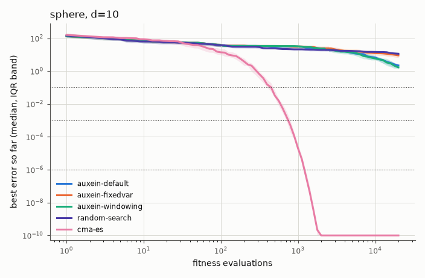

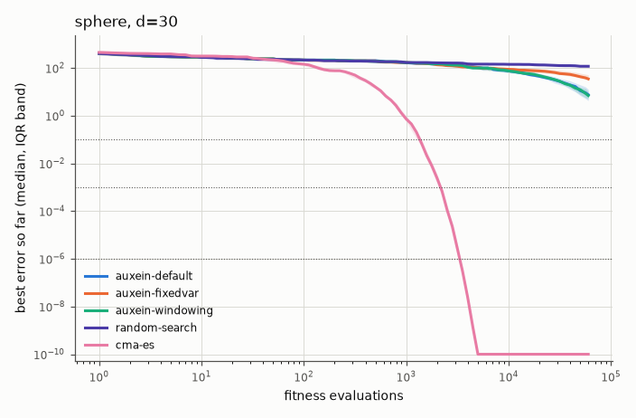

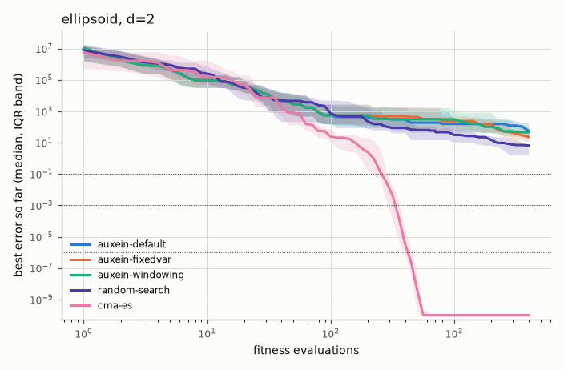

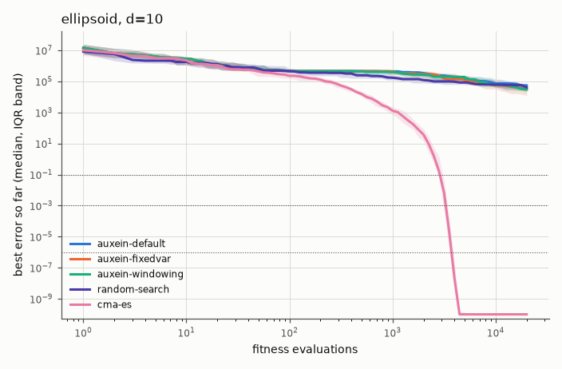

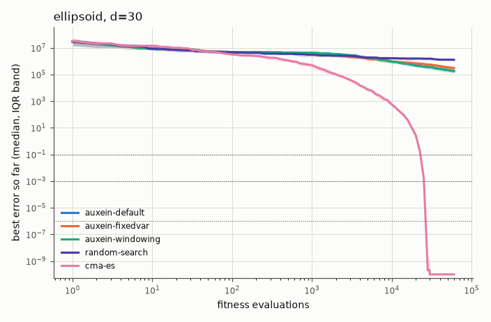

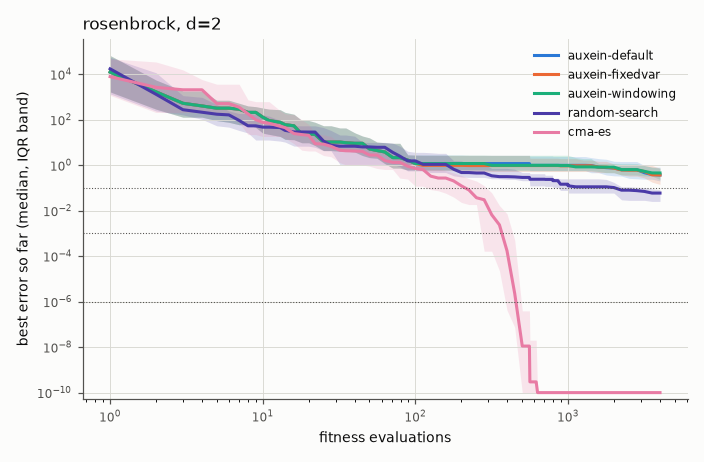

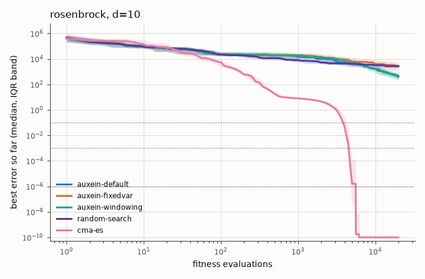

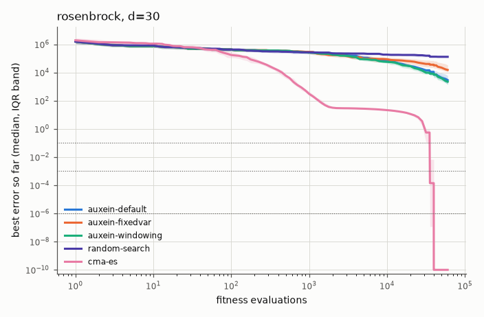

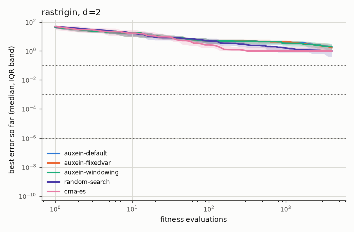

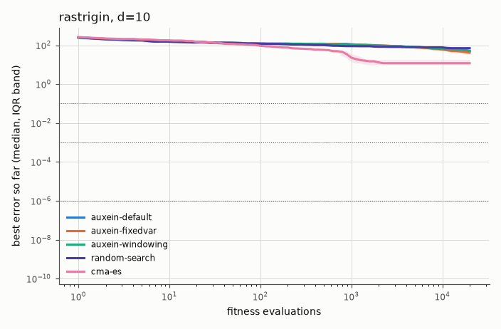

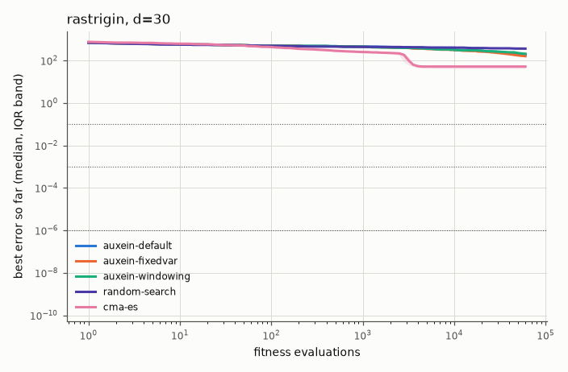

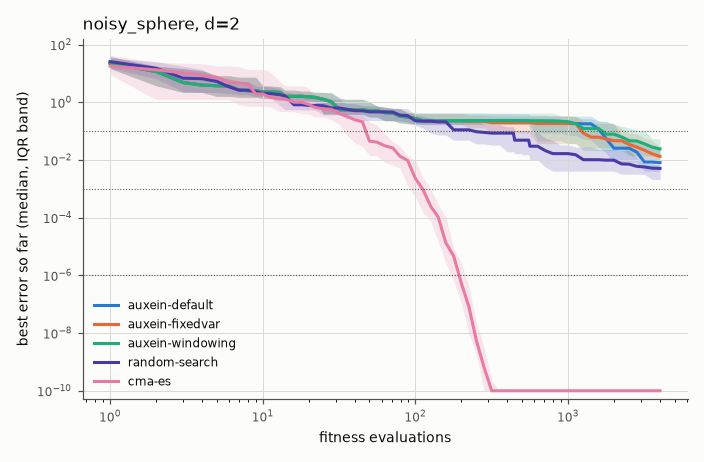

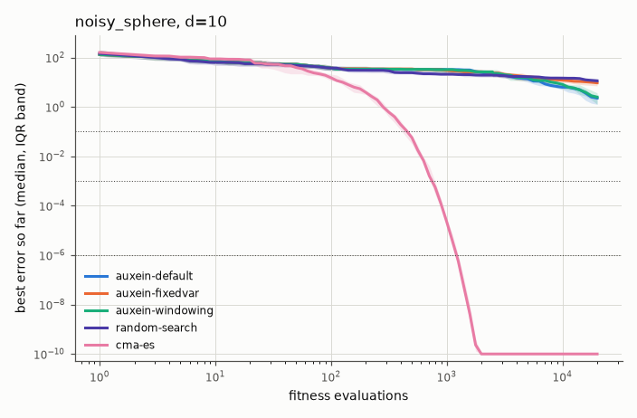

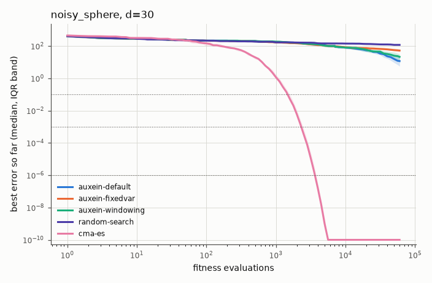

## 2. Summary

Final error, success rate per precision target (runs that reached it) and expected running time (ERT, in evaluations).

### sphere, d=2

| Algorithm | Final error, median [IQR] | Success 0.1 | Success 0.001 | Success 1e-06 | ERT 0.1 | ERT 0.001 | ERT 1e-06 |
|---|---|---|---|---|---|---|---|
| auxein-default | 0.01 [1.96e-03, 0.0329] | 25/25 | 1/25 | 0/25 | 1,784 | 99,951 | ∞ |
| auxein-fixedvar | 8.10e-03 [2.98e-03, 0.0187] | 22/25 | 1/25 | 0/25 | 1,850 | 99,845 | ∞ |
| auxein-windowing | 0.0242 [7.23e-03, 0.056] | 21/25 | 1/25 | 0/25 | 2,381 | 99,326 | ∞ |
| random-search | 5.14e-03 [2.11e-03, 6.64e-03] | 25/25 | 3/25 | 0/25 | 334 | 29,733 | ∞ |
| cma-es | 2.28e-16 [7.91e-17, 1.18e-15] | 25/25 | 25/25 | 25/25 | 48 | 105 | 193 |

### sphere, d=10

| Algorithm | Final error, median [IQR] | Success 0.1 | Success 0.001 | Success 1e-06 | ERT 0.1 | ERT 0.001 | ERT 1e-06 |
|---|---|---|---|---|---|---|---|
| auxein-default | 2.19 [1.51, 2.77] | 0/25 | 0/25 | 0/25 | ∞ | ∞ | ∞ |
| auxein-fixedvar | 9.03 [6.59, 12.5] | 0/25 | 0/25 | 0/25 | ∞ | ∞ | ∞ |
| auxein-windowing | 1.68 [1.34, 2.11] | 0/25 | 0/25 | 0/25 | ∞ | ∞ | ∞ |
| random-search | 11.3 [9.1, 14.1] | 0/25 | 0/25 | 0/25 | ∞ | ∞ | ∞ |
| cma-es | 1.72e-14 [1.12e-14, 2.79e-14] | 25/25 | 25/25 | 25/25 | 444 | 759 | 1,218 |

### sphere, d=30

| Algorithm | Final error, median [IQR] | Success 0.1 | Success 0.001 | Success 1e-06 | ERT 0.1 | ERT 0.001 | ERT 1e-06 |
|---|---|---|---|---|---|---|---|
| auxein-default | 7.58 [4.28, 12.8] | 0/25 | 0/25 | 0/25 | ∞ | ∞ | ∞ |
| auxein-fixedvar | 34.9 [32.2, 52.2] | 0/25 | 0/25 | 0/25 | ∞ | ∞ | ∞ |
| auxein-windowing | 6.98 [5.16, 10.2] | 0/25 | 0/25 | 0/25 | ∞ | ∞ | ∞ |
| random-search | 118 [112, 131] | 0/25 | 0/25 | 0/25 | ∞ | ∞ | ∞ |
| cma-es | 2.84e-14 [2.41e-14, 3.36e-14] | 25/25 | 25/25 | 25/25 | 1,354 | 2,138 | 3,311 |

### ellipsoid, d=2

| Algorithm | Final error, median [IQR] | Success 0.1 | Success 0.001 | Success 1e-06 | ERT 0.1 | ERT 0.001 | ERT 1e-06 |
|---|---|---|---|---|---|---|---|
| auxein-default | 58.2 [29.5, 189] | 0/25 | 0/25 | 0/25 | ∞ | ∞ | ∞ |
| auxein-fixedvar | 23.4 [11.1, 60.6] | 0/25 | 0/25 | 0/25 | ∞ | ∞ | ∞ |
| auxein-windowing | 46.5 [24.2, 109] | 0/25 | 0/25 | 0/25 | ∞ | ∞ | ∞ |
| random-search | 6.66 [1.62, 8.28] | 0/25 | 0/25 | 0/25 | ∞ | ∞ | ∞ |
| cma-es | 2.26e-16 [1.02e-16, 5.65e-16] | 25/25 | 25/25 | 25/25 | 253 | 329 | 422 |

### ellipsoid, d=10

| Algorithm | Final error, median [IQR] | Success 0.1 | Success 0.001 | Success 1e-06 | ERT 0.1 | ERT 0.001 | ERT 1e-06 |
|---|---|---|---|---|---|---|---|
| auxein-default | 5.48e+04 [2.58e+04, 7.41e+04] | 0/25 | 0/25 | 0/25 | ∞ | ∞ | ∞ |
| auxein-fixedvar | 3.08e+04 [1.25e+04, 6.45e+04] | 0/25 | 0/25 | 0/25 | ∞ | ∞ | ∞ |
| auxein-windowing | 3.08e+04 [1.92e+04, 5.88e+04] | 0/25 | 0/25 | 0/25 | ∞ | ∞ | ∞ |
| random-search | 4.11e+04 [3.11e+04, 6.28e+04] | 0/25 | 0/25 | 0/25 | ∞ | ∞ | ∞ |
| cma-es | 1.50e-14 [9.83e-15, 2.26e-14] | 25/25 | 25/25 | 25/25 | 2,892 | 3,275 | 3,727 |

### ellipsoid, d=30

| Algorithm | Final error, median [IQR] | Success 0.1 | Success 0.001 | Success 1e-06 | ERT 0.1 | ERT 0.001 | ERT 1e-06 |
|---|---|---|---|---|---|---|---|
| auxein-default | 1.79e+05 [1.34e+05, 2.57e+05] | 0/25 | 0/25 | 0/25 | ∞ | ∞ | ∞ |
| auxein-fixedvar | 3.06e+05 [2.18e+05, 4.34e+05] | 0/25 | 0/25 | 0/25 | ∞ | ∞ | ∞ |
| auxein-windowing | 1.88e+05 [1.49e+05, 2.85e+05] | 0/25 | 0/25 | 0/25 | ∞ | ∞ | ∞ |
| random-search | 1.28e+06 [1.06e+06, 1.44e+06] | 0/25 | 0/25 | 0/25 | ∞ | ∞ | ∞ |
| cma-es | 2.34e-14 [1.95e-14, 2.83e-14] | 25/25 | 25/25 | 25/25 | 22,601 | 25,046 | 26,711 |

### rosenbrock, d=2

| Algorithm | Final error, median [IQR] | Success 0.1 | Success 0.001 | Success 1e-06 | ERT 0.1 | ERT 0.001 | ERT 1e-06 |
|---|---|---|---|---|---|---|---|
| auxein-default | 0.373 [0.205, 0.828] | 5/25 | 1/25 | 0/25 | 18,057 | 97,350 | ∞ |
| auxein-fixedvar | 0.373 [0.145, 0.75] | 4/25 | 0/25 | 0/25 | 23,468 | ∞ | ∞ |
| auxein-windowing | 0.457 [0.24, 0.75] | 2/25 | 0/25 | 0/25 | 49,378 | ∞ | ∞ |
| random-search | 0.0597 [0.0256, 0.0843] | 20/25 | 0/25 | 0/25 | 2,665 | ∞ | ∞ |
| cma-es | 4.75e-16 [5.27e-17, 8.25e-16] | 25/25 | 25/25 | 25/25 | 228 | 376 | 470 |

### rosenbrock, d=10

| Algorithm | Final error, median [IQR] | Success 0.1 | Success 0.001 | Success 1e-06 | ERT 0.1 | ERT 0.001 | ERT 1e-06 |
|---|---|---|---|---|---|---|---|
| auxein-default | 466 [249, 765] | 0/25 | 0/25 | 0/25 | ∞ | ∞ | ∞ |
| auxein-fixedvar | 2.69e+03 [1.06e+03, 4.6e+03] | 0/25 | 0/25 | 0/25 | ∞ | ∞ | ∞ |
| auxein-windowing | 395 [228, 790] | 0/25 | 0/25 | 0/25 | ∞ | ∞ | ∞ |
| random-search | 2.74e+03 [1.89e+03, 3.74e+03] | 0/25 | 0/25 | 0/25 | ∞ | ∞ | ∞ |
| cma-es | 1.66e-14 [8.25e-15, 2.20e-14] | 24/25 | 24/25 | 24/25 | 4,402 | 4,994 | 5,477 |

### rosenbrock, d=30

| Algorithm | Final error, median [IQR] | Success 0.1 | Success 0.001 | Success 1e-06 | ERT 0.1 | ERT 0.001 | ERT 1e-06 |
|---|---|---|---|---|---|---|---|
| auxein-default | 2.85e+03 [1.55e+03, 5.96e+03] | 0/25 | 0/25 | 0/25 | ∞ | ∞ | ∞ |
| auxein-fixedvar | 1.51e+04 [1.08e+04, 3.37e+04] | 0/25 | 0/25 | 0/25 | ∞ | ∞ | ∞ |
| auxein-windowing | 2.21e+03 [1.34e+03, 3.92e+03] | 0/25 | 0/25 | 0/25 | ∞ | ∞ | ∞ |
| random-search | 1.29e+05 [1.15e+05, 1.58e+05] | 0/25 | 0/25 | 0/25 | ∞ | ∞ | ∞ |
| cma-es | 3.71e-14 [2.44e-14, 4.63e-14] | 20/25 | 20/25 | 20/25 | 41,642 | 43,466 | 44,986 |

### rastrigin, d=2

| Algorithm | Final error, median [IQR] | Success 0.1 | Success 0.001 | Success 1e-06 | ERT 0.1 | ERT 0.001 | ERT 1e-06 |
|---|---|---|---|---|---|---|---|
| auxein-default | 1.84 [1.17, 2.95] | 1/25 | 0/25 | 0/25 | 99,430 | ∞ | ∞ |
| auxein-fixedvar | 1.69 [1.12, 2.57] | 0/25 | 0/25 | 0/25 | ∞ | ∞ | ∞ |
| auxein-windowing | 2.01 [0.928, 3.17] | 0/25 | 0/25 | 0/25 | ∞ | ∞ | ∞ |
| random-search | 0.995 [0.415, 1.15] | 1/25 | 0/25 | 0/25 | 96,447 | ∞ | ∞ |
| cma-es | 0.995 [0.995, 1.99] | 4/25 | 4/25 | 4/25 | 3,546 | 3,601 | 3,710 |

### rastrigin, d=10

| Algorithm | Final error, median [IQR] | Success 0.1 | Success 0.001 | Success 1e-06 | ERT 0.1 | ERT 0.001 | ERT 1e-06 |
|---|---|---|---|---|---|---|---|
| auxein-default | 51.1 [47.3, 60.4] | 0/25 | 0/25 | 0/25 | ∞ | ∞ | ∞ |
| auxein-fixedvar | 41.5 [34.2, 47.3] | 0/25 | 0/25 | 0/25 | ∞ | ∞ | ∞ |
| auxein-windowing | 52.2 [41.7, 57.3] | 0/25 | 0/25 | 0/25 | ∞ | ∞ | ∞ |
| random-search | 70.8 [66.2, 75.5] | 0/25 | 0/25 | 0/25 | ∞ | ∞ | ∞ |
| cma-es | 11.9 [9.95, 17.9] | 0/25 | 0/25 | 0/25 | ∞ | ∞ | ∞ |

### rastrigin, d=30

| Algorithm | Final error, median [IQR] | Success 0.1 | Success 0.001 | Success 1e-06 | ERT 0.1 | ERT 0.001 | ERT 1e-06 |
|---|---|---|---|---|---|---|---|
| auxein-default | 191 [137, 229] | 0/25 | 0/25 | 0/25 | ∞ | ∞ | ∞ |
| auxein-fixedvar | 161 [151, 176] | 0/25 | 0/25 | 0/25 | ∞ | ∞ | ∞ |
| auxein-windowing | 207 [154, 225] | 0/25 | 0/25 | 0/25 | ∞ | ∞ | ∞ |
| random-search | 362 [354, 377] | 0/25 | 0/25 | 0/25 | ∞ | ∞ | ∞ |
| cma-es | 51.7 [42.8, 58.7] | 0/25 | 0/25 | 0/25 | ∞ | ∞ | ∞ |

### noisy_sphere, d=2

| Algorithm | Final error, median [IQR] | Success 0.1 | Success 0.001 | Success 1e-06 | ERT 0.1 | ERT 0.001 | ERT 1e-06 |
|---|---|---|---|---|---|---|---|
| auxein-default | 8.15e-03 [4.08e-03, 0.0281] | 24/25 | 0/25 | 0/25 | 1,622 | ∞ | ∞ |
| auxein-fixedvar | 0.0134 [8.01e-03, 0.0298] | 22/25 | 0/25 | 0/25 | 1,698 | ∞ | ∞ |
| auxein-windowing | 0.0243 [0.0119, 0.0542] | 22/25 | 1/25 | 0/25 | 2,053 | 96,622 | ∞ |
| random-search | 5.14e-03 [2.11e-03, 6.64e-03] | 25/25 | 3/25 | 0/25 | 334 | 29,733 | ∞ |
| cma-es | 3.06e-16 [1.09e-16, 5.64e-16] | 25/25 | 25/25 | 25/25 | 47 | 108 | 193 |

### noisy_sphere, d=10

| Algorithm | Final error, median [IQR] | Success 0.1 | Success 0.001 | Success 1e-06 | ERT 0.1 | ERT 0.001 | ERT 1e-06 |
|---|---|---|---|---|---|---|---|
| auxein-default | 2.26 [1.27, 2.76] | 0/25 | 0/25 | 0/25 | ∞ | ∞ | ∞ |
| auxein-fixedvar | 9.41 [7.12, 12.4] | 0/25 | 0/25 | 0/25 | ∞ | ∞ | ∞ |
| auxein-windowing | 2.5 [1.3, 3.69] | 0/25 | 0/25 | 0/25 | ∞ | ∞ | ∞ |
| random-search | 11.3 [9.1, 14.1] | 0/25 | 0/25 | 0/25 | ∞ | ∞ | ∞ |
| cma-es | 1.73e-14 [9.87e-15, 2.61e-14] | 25/25 | 25/25 | 25/25 | 454 | 761 | 1,220 |

### noisy_sphere, d=30

| Algorithm | Final error, median [IQR] | Success 0.1 | Success 0.001 | Success 1e-06 | ERT 0.1 | ERT 0.001 | ERT 1e-06 |
|---|---|---|---|---|---|---|---|
| auxein-default | 11.7 [5.62, 19.9] | 0/25 | 0/25 | 0/25 | ∞ | ∞ | ∞ |
| auxein-fixedvar | 52.5 [42.5, 63.8] | 0/25 | 0/25 | 0/25 | ∞ | ∞ | ∞ |
| auxein-windowing | 21.4 [9.69, 32] | 0/25 | 0/25 | 0/25 | ∞ | ∞ | ∞ |
| random-search | 118 [112, 131] | 0/25 | 0/25 | 0/25 | ∞ | ∞ | ∞ |
| cma-es | 4.25e-14 [3.51e-14, 5.44e-14] | 25/25 | 25/25 | 25/25 | 1,503 | 2,356 | 3,661 |

## 3. Statistical comparison

Final error of `auxein-default` against every other algorithm: two-sided Mann-Whitney U with Holm correction within each table, and the Vargha-Delaney A12 effect size (the probability that `auxein-default` wins).

### sphere, d=2

| auxein-default vs | median error (auxein-default) | median error (other) | A12 | p | p (Holm) | Reading |
|---|---|---|---|---|---|---|
| auxein-fixedvar | 0.01 | 8.10e-03 | 0.45 | 0.59 | 0.59 | no significant difference (negligible effect) |
| auxein-windowing | 0.01 | 0.0242 | 0.61 | 0.19 | 0.38 | no significant difference (small effect) |
| random-search | 0.01 | 5.14e-03 | 0.33 | 0.046 | 0.14 | no significant difference (medium effect) |
| cma-es | 0.01 | 2.28e-16 | 0.00 | 1.4e-09 | 5.7e-09 | cma-es better, large effect |

### sphere, d=10

| auxein-default vs | median error (auxein-default) | median error (other) | A12 | p | p (Holm) | Reading |
|---|---|---|---|---|---|---|
| auxein-fixedvar | 2.19 | 9.03 | 0.97 | 1.2e-08 | 2.3e-08 | auxein-default better, large effect |
| auxein-windowing | 2.19 | 1.68 | 0.40 | 0.24 | 0.24 | no significant difference (small effect) |
| random-search | 2.19 | 11.3 | 1.00 | 1.4e-09 | 5.7e-09 | auxein-default better, large effect |
| cma-es | 2.19 | 1.72e-14 | 0.00 | 1.4e-09 | 5.7e-09 | cma-es better, large effect |

### sphere, d=30

| auxein-default vs | median error (auxein-default) | median error (other) | A12 | p | p (Holm) | Reading |
|---|---|---|---|---|---|---|
| auxein-fixedvar | 7.58 | 34.9 | 0.97 | 9.3e-09 | 1.9e-08 | auxein-default better, large effect |
| auxein-windowing | 7.58 | 6.98 | 0.49 | 0.95 | 0.95 | no significant difference (negligible effect) |
| random-search | 7.58 | 118 | 1.00 | 1.4e-09 | 5.7e-09 | auxein-default better, large effect |
| cma-es | 7.58 | 2.84e-14 | 0.00 | 1.4e-09 | 5.7e-09 | cma-es better, large effect |

### ellipsoid, d=2

| auxein-default vs | median error (auxein-default) | median error (other) | A12 | p | p (Holm) | Reading |
|---|---|---|---|---|---|---|
| auxein-fixedvar | 58.2 | 23.4 | 0.30 | 0.014 | 0.029 | auxein-fixedvar better, medium effect |
| auxein-windowing | 58.2 | 46.5 | 0.44 | 0.46 | 0.46 | no significant difference (small effect) |
| random-search | 58.2 | 6.66 | 0.09 | 9.2e-07 | 2.7e-06 | random-search better, large effect |
| cma-es | 58.2 | 2.26e-16 | 0.00 | 1.4e-09 | 5.7e-09 | cma-es better, large effect |

### ellipsoid, d=10

| auxein-default vs | median error (auxein-default) | median error (other) | A12 | p | p (Holm) | Reading |
|---|---|---|---|---|---|---|
| auxein-fixedvar | 5.48e+04 | 3.08e+04 | 0.38 | 0.15 | 0.44 | no significant difference (small effect) |
| auxein-windowing | 5.48e+04 | 3.08e+04 | 0.40 | 0.24 | 0.49 | no significant difference (small effect) |
| random-search | 5.48e+04 | 4.11e+04 | 0.48 | 0.8 | 0.8 | no significant difference (negligible effect) |
| cma-es | 5.48e+04 | 1.50e-14 | 0.00 | 1.4e-09 | 5.7e-09 | cma-es better, large effect |

### ellipsoid, d=30

| auxein-default vs | median error (auxein-default) | median error (other) | A12 | p | p (Holm) | Reading |
|---|---|---|---|---|---|---|
| auxein-fixedvar | 1.79e+05 | 3.06e+05 | 0.72 | 0.0079 | 0.016 | auxein-default better, large effect |
| auxein-windowing | 1.79e+05 | 1.88e+05 | 0.57 | 0.4 | 0.4 | no significant difference (small effect) |
| random-search | 1.79e+05 | 1.28e+06 | 1.00 | 1.4e-09 | 5.7e-09 | auxein-default better, large effect |
| cma-es | 1.79e+05 | 2.34e-14 | 0.00 | 1.4e-09 | 5.7e-09 | cma-es better, large effect |

### rosenbrock, d=2

| auxein-default vs | median error (auxein-default) | median error (other) | A12 | p | p (Holm) | Reading |
|---|---|---|---|---|---|---|
| auxein-fixedvar | 0.373 | 0.373 | 0.50 | 0.97 | 1 | no significant difference (negligible effect) |
| auxein-windowing | 0.373 | 0.457 | 0.54 | 0.59 | 1 | no significant difference (negligible effect) |
| random-search | 0.373 | 0.0597 | 0.15 | 2e-05 | 5.9e-05 | random-search better, large effect |
| cma-es | 0.373 | 4.75e-16 | 0.00 | 1.4e-09 | 5.7e-09 | cma-es better, large effect |

### rosenbrock, d=10

| auxein-default vs | median error (auxein-default) | median error (other) | A12 | p | p (Holm) | Reading |
|---|---|---|---|---|---|---|
| auxein-fixedvar | 466 | 2.69e+03 | 0.92 | 2.7e-07 | 5.4e-07 | auxein-default better, large effect |
| auxein-windowing | 466 | 395 | 0.51 | 0.88 | 0.88 | no significant difference (negligible effect) |
| random-search | 466 | 2.74e+03 | 1.00 | 1.4e-09 | 5.7e-09 | auxein-default better, large effect |
| cma-es | 466 | 1.66e-14 | 0.00 | 1.4e-09 | 5.7e-09 | cma-es better, large effect |

### rosenbrock, d=30

| auxein-default vs | median error (auxein-default) | median error (other) | A12 | p | p (Holm) | Reading |
|---|---|---|---|---|---|---|
| auxein-fixedvar | 2.85e+03 | 1.51e+04 | 0.96 | 3.6e-08 | 7.2e-08 | auxein-default better, large effect |
| auxein-windowing | 2.85e+03 | 2.21e+03 | 0.45 | 0.56 | 0.56 | no significant difference (negligible effect) |
| random-search | 2.85e+03 | 1.29e+05 | 1.00 | 1.4e-09 | 5.7e-09 | auxein-default better, large effect |
| cma-es | 2.85e+03 | 3.71e-14 | 0.00 | 1.4e-09 | 5.7e-09 | cma-es better, large effect |

### rastrigin, d=2

| auxein-default vs | median error (auxein-default) | median error (other) | A12 | p | p (Holm) | Reading |
|---|---|---|---|---|---|---|
| auxein-fixedvar | 1.84 | 1.69 | 0.50 | 0.96 | 1 | no significant difference (negligible effect) |
| auxein-windowing | 1.84 | 2.01 | 0.53 | 0.71 | 1 | no significant difference (negligible effect) |
| random-search | 1.84 | 0.995 | 0.20 | 0.00033 | 0.0013 | random-search better, large effect |
| cma-es | 1.84 | 0.995 | 0.37 | 0.12 | 0.36 | no significant difference (small effect) |

### rastrigin, d=10

| auxein-default vs | median error (auxein-default) | median error (other) | A12 | p | p (Holm) | Reading |
|---|---|---|---|---|---|---|
| auxein-fixedvar | 51.1 | 41.5 | 0.21 | 0.00051 | 0.001 | auxein-fixedvar better, large effect |
| auxein-windowing | 51.1 | 52.2 | 0.41 | 0.28 | 0.28 | no significant difference (small effect) |
| random-search | 51.1 | 70.8 | 0.91 | 8.3e-07 | 2.5e-06 | auxein-default better, large effect |
| cma-es | 51.1 | 11.9 | 0.00 | 1.6e-09 | 6.4e-09 | cma-es better, large effect |

### rastrigin, d=30

| auxein-default vs | median error (auxein-default) | median error (other) | A12 | p | p (Holm) | Reading |
|---|---|---|---|---|---|---|
| auxein-fixedvar | 191 | 161 | 0.41 | 0.29 | 0.59 | no significant difference (small effect) |
| auxein-windowing | 191 | 207 | 0.52 | 0.86 | 0.86 | no significant difference (negligible effect) |
| random-search | 191 | 362 | 1.00 | 1.4e-09 | 5.7e-09 | auxein-default better, large effect |
| cma-es | 191 | 51.7 | 0.00 | 1.4e-09 | 5.7e-09 | cma-es better, large effect |

### noisy_sphere, d=2

| auxein-default vs | median error (auxein-default) | median error (other) | A12 | p | p (Holm) | Reading |
|---|---|---|---|---|---|---|
| auxein-fixedvar | 8.15e-03 | 0.0134 | 0.60 | 0.25 | 0.25 | no significant difference (small effect) |
| auxein-windowing | 8.15e-03 | 0.0243 | 0.67 | 0.037 | 0.074 | no significant difference (medium effect) |
| random-search | 8.15e-03 | 5.14e-03 | 0.27 | 0.0052 | 0.016 | random-search better, large effect |
| cma-es | 8.15e-03 | 3.06e-16 | 0.00 | 1.4e-09 | 5.7e-09 | cma-es better, large effect |

### noisy_sphere, d=10

| auxein-default vs | median error (auxein-default) | median error (other) | A12 | p | p (Holm) | Reading |
|---|---|---|---|---|---|---|
| auxein-fixedvar | 2.26 | 9.41 | 0.96 | 2.3e-08 | 4.6e-08 | auxein-default better, large effect |
| auxein-windowing | 2.26 | 2.5 | 0.59 | 0.29 | 0.29 | no significant difference (small effect) |
| random-search | 2.26 | 11.3 | 1.00 | 1.8e-09 | 5.7e-09 | auxein-default better, large effect |
| cma-es | 2.26 | 1.73e-14 | 0.00 | 1.4e-09 | 5.7e-09 | cma-es better, large effect |

### noisy_sphere, d=30

| auxein-default vs | median error (auxein-default) | median error (other) | A12 | p | p (Holm) | Reading |
|---|---|---|---|---|---|---|
| auxein-fixedvar | 11.7 | 52.5 | 0.96 | 2.9e-08 | 5.7e-08 | auxein-default better, large effect |
| auxein-windowing | 11.7 | 21.4 | 0.66 | 0.048 | 0.048 | auxein-default better, medium effect |
| random-search | 11.7 | 118 | 1.00 | 1.4e-09 | 5.7e-09 | auxein-default better, large effect |
| cma-es | 11.7 | 4.25e-14 | 0.00 | 1.4e-09 | 5.7e-09 | cma-es better, large effect |

## 4. Overhead

Median time per fitness evaluation, in microseconds, on a negligible-cost objective.

| Algorithm | Dimension | population 50 | population 200 | population 800 |
|---|---|---|---|---|
| auxein-default | 2 | 12.1 | 10.4 | 10.1 |
| auxein-default | 10 | 12.0 | 10.5 | 10.2 |
| auxein-default | 100 | 12.9 | 11.0 | 10.5 |
| auxein-fixedvar | 2 | 11.8 | 10.5 | 10.1 |
| auxein-fixedvar | 10 | 11.8 | 10.4 | 10.2 |
| auxein-fixedvar | 100 | 12.8 | 11.0 | 10.5 |
| auxein-windowing | 2 | 11.5 | 10.2 | 10.0 |
| auxein-windowing | 10 | 11.6 | 10.3 | 10.0 |
| auxein-windowing | 100 | 12.5 | 10.8 | 10.4 |

| Algorithm | d=2 | d=10 | d=100 |
|---|---|---|---|
| random-search | 0.7 | 0.7 | 1.0 |
| cma-es | 27.2 | 18.5 | 35.6 |

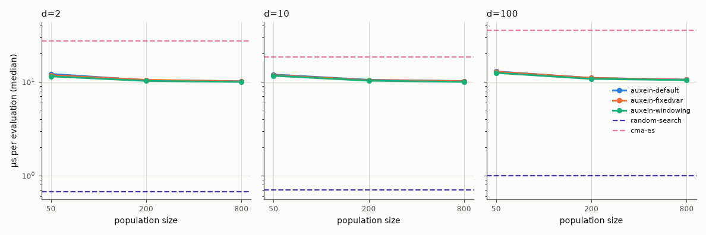
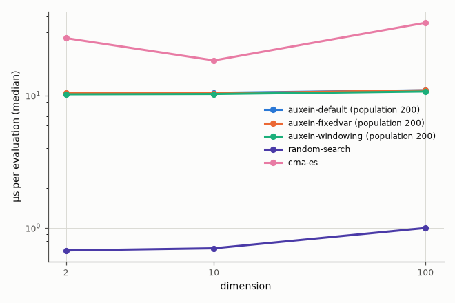

Fitness evaluations per generation, and generations completed within the overhead budget (median over dimensions).

| Algorithm | Population | Evaluations per generation | Generations |
|---|---|---|---|
| auxein-default | 50 | 54 | 369 |
| auxein-default | 200 | 204 | 97 |
| auxein-default | 800 | 804 | 23 |
| auxein-fixedvar | 50 | 54 | 369 |
| auxein-fixedvar | 200 | 204 | 97 |
| auxein-fixedvar | 800 | 804 | 23 |
| auxein-windowing | 50 | 54 | 369 |
| auxein-windowing | 200 | 204 | 97 |
| auxein-windowing | 800 | 804 | 23 |

## 5. Sanity checks

- PASS: CMA-ES reaches 1e-6 on 10-D sphere: 25/25 runs reached 1e-6 (need at least 90%)
- PASS: CMA-ES reaches 1e-6 on 10-D ellipsoid: 25/25 runs reached 1e-6 (need at least 90%)
- PASS: random search does not reach 1e-3 on 10-D sphere: 0/25 runs reached 1e-3 (need none)

## 6. Methodology

- **Config**: `full`, commit `934182ac4d`, run at 2026-10-07T13:13:21+00:00 on 11 worker processes.
- **Software**: Python 3.12.13, auxein 0.2.0, numpy 2.5.3, pycma 4.5.0, scipy 1.18.1.
- **Machine**: Apple M4 Pro (12 logical CPUs), macOS-15.6.1-arm64-arm-64bit.
- **Budget**: 2000 × d fitness evaluations for every algorithm, counted outside the algorithms by `CountingObjective`. The initial population counts, and a partial generation is fine. Progress is always against evaluations, never generations.
- **Domain and conventions**: search domain [-5, 5]^d for every problem, boundaries not enforced. Optimum value 0, results are errors f(x) − f*. Algorithms see the noisy value on the noisy problem, the trace records the noise-free error of the evaluated point.
- **Instances**: each instance has its own random shift x* ~ U[-4, 4]^d (and, for the ellipsoid, a uniform random rotation from a QR decomposition with sign correction), drawn from a generator keyed by the instance id and the dimension, separate from algorithm randomness. Run k of every algorithm uses instance k, so comparisons are paired. 25 runs per combination.
- **Seeds**: run k uses seed 0 + k. Auxein is seeded with `np.random.seed(seed)` (it uses global numpy randomness), random search with `np.random.default_rng(seed)`, CMA-ES with seed + 1.
- **Precision targets**: 0.1, 0.001, 1e-06.
- **Traces**: best-so-far error at about 20 log-spaced evaluation counts per decade, plus the first and last evaluation. Plots show the median and the interquartile band over runs at each checkpoint. Errors below 1e-10 are drawn at 1e-10; dotted lines mark the targets.
- **Statistics**: two-sided Mann-Whitney U test on the final error of `auxein-default` against every other algorithm (scipy), with Holm correction over the comparisons of each problem × dimension table. A12 is the probability that a `auxein-default` run ends with a lower error than a run of the other algorithm (ties count half); 0.5 is no difference. Effect size labels follow Vargha and Delaney: negligible below |A12 − 0.5| = 0.06, small below 0.14, medium below 0.21, large above. Significance level 0.05.
- **ERT (expected running time)**: total evaluations spent over all runs, divided by the number of successful runs, infinity if there is none. A successful run spends the evaluations it needed to first reach the target, an unsuccessful run spends everything it evaluated. It estimates the evaluations needed to reach the target if failed runs were restarted from scratch.
- **Algorithms**:
  - `auxein-default` (adapter `auxein_static`): `{"population_size": 100, "mutation": {"type": "self_adaptive", "tau": 0.1}, "distribution": "sigma_scaling", "offspring_size": 4, "alpha": 0.5}`
  - `auxein-fixedvar` (adapter `auxein_static`): `{"population_size": 100, "mutation": {"type": "fixed_variance", "sigma": 0.1}, "distribution": "sigma_scaling", "offspring_size": 4, "alpha": 0.5}`
  - `auxein-windowing` (adapter `auxein_static`): `{"population_size": 100, "mutation": {"type": "self_adaptive", "tau": 0.1}, "distribution": "fps_windowing", "offspring_size": 4, "alpha": 0.5}`
  - `random-search` (adapter `random_search`): `{}`
  - `cma-es` (adapter `cmaes`): `{"sigma0": 2.0, "x0_range": 4.0}`
- **Overhead benchmark**: Plain sphere, 20000 evaluations, 5 repeats (median reported), dimensions [2, 10, 100], population sizes [50, 200, 800] for the algorithms with a population. Run serially, after the quality runs, with one numpy thread per process. The time covers everything the algorithm does, including building the initial population and the budget-counting wrapper (identical for every algorithm).

### Algorithms and problems

| Problem | Definition (z = transformed x) | Tests |
|---|---|---|
| sphere | `Σ z_i²`, z = x − x* | sanity: everything should solve it |
| ellipsoid | `Σ 10^(6(i−1)/(d−1)) z_i²` (condition number 10⁶), z = R(x − x*) with a random rotation R | step-size adaptation across very different scales; rotation defeats per-axis tricks |
| rosenbrock | `Σ_{i<d} 100(z_{i+1} − z_i²)² + (1 − z_i)²`, z = x − x* + 1 | following a narrow curved valley |
| rastrigin | `10d + Σ (z_i² − 10 cos(2π z_i))`, z = x − x* | many regularly spaced local optima |
| noisy_sphere | sphere × `(1 + 0.1·ε)`, ε ~ N(0, 1) per call | robustness to noisy fitness (the trace records the noise-free error) |

### Reproducing

```
uv run --group bench python -m benchmarks run --config benchmarks/configs/full.toml
uv run --group bench python -m benchmarks report <results-dir>
```

The same config, commit and seeds give identical `runs.jsonl` contents, except for the `wall_time` fields.
