# Auxein benchmark report: full

## Findings

The new `GeneticAlgorithm` (`auxein-core-ga`, its constructor defaults: μ = λ = 50, tournament selection of size 2, intermediate recombination, one self-adaptive step size per individual, clipping) against the 0.2.0 engine (`auxein-default` and the two other 0.2.0 configurations), random search and CMA-ES. All numbers come from this one run: the same machine, the same 25 instances and seeds per problem × dimension, and a budget of 2000 × d evaluations. The acceptance criteria are those of design doc §11.4, criterion 2.

**Criterion 1, quality: met.** `auxein-core-ga` is not worse than `auxein-default` (0.2.0) on any of the 15 problem × dimension cells: it is **better on all 15, with a large effect** (A₁₂ between 0.00 and 0.04 for 0.2.0, Holm-adjusted Mann–Whitney p ≤ 10⁻⁷ everywhere).

| Median final error | 0.2.0 (`auxein-default`) | `auxein-core-ga` | CMA-ES |
|---|---|---|---|
| sphere d = 10 | 2.19 | 1.2 × 10⁻²² | 1.7 × 10⁻¹⁴ |
| ellipsoid d = 10 | 5.5 × 10⁴ | 1.3 × 10³ | 1.5 × 10⁻¹⁴ |
| Rosenbrock d = 10 | 466 | 7.8 | 1.7 × 10⁻¹⁴ |
| Rastrigin d = 10 | 51.1 | 8.0 | 11.9 |
| sphere d = 30 | 7.58 | 1.3 × 10⁻²¹ | 2.8 × 10⁻¹⁴ |
| ellipsoid d = 30 | 1.8 × 10⁵ | 9.6 × 10³ | 2.3 × 10⁻¹⁴ |
| Rosenbrock d = 30 | 2,850 | 27.5 | 3.7 × 10⁻¹⁴ |
| Rastrigin d = 30 | 191 | 38.8 | 51.7 |

- The gains are largest where 0.2.0 was weakest. 0.2.0 reached an error of 10⁻³ in only 2 of its 375 runs and 10⁻⁶ in none; the new GA reaches 10⁻⁶ in 25/25 runs on the sphere and the noisy sphere at every dimension, in 23/25 on 2-D Rastrigin (the optimum, 0, exactly), in 9/25 on 2-D Rosenbrock and in 2/25 on the 2-D ellipsoid. It reaches 10⁻⁶ in no run on the ellipsoid, Rosenbrock or Rastrigin at d = 10 and 30.
- The mean rank of the median final error over the 15 cells is 1.40 for `auxein-core-ga`, 1.60 for CMA-ES, and 4.60 for `auxein-default`.

**Criterion 2, overhead: met after an optimisation.** Time per evaluation on a negligible-cost objective, at every population size and dimension of the overhead benchmark:

| μ (λ = 50) | d = 2 | d = 10 | d = 100 |
|---|---|---|---|
| 50: 0.2.0 → `auxein-core-ga` | 11.3 → 4.9 µs | 11.3 → 5.1 µs | 12.1 → 5.9 µs |
| 200 | 10.0 → 5.4 µs | 9.8 → 5.5 µs | 10.2 → 6.3 µs |
| 800 | 9.4 → 6.4 µs | 9.6 → 6.4 µs | 9.8 → 7.6 µs |

- **The first run of this comparison did not meet it.** Before any optimisation the new GA took 7.4 to 11.3 µs per evaluation, and at population 800 it was slower than 0.2.0 in two of three dimensions (10.0 against 9.4 µs at d = 10, 11.3 against 9.6 µs at d = 100) and equal at d = 2 (9.8 µs). Profiling showed the cost was in per-candidate `Evaluation` construction and validation, candidates rebuilt for the result check, a per-evaluation Python loop in the result tracker and, in the GA, Python work proportional to the population and two copies of every array on each `tell`. These were removed without changing any public behaviour; the existing tests pass unmodified. The driver's own cost per evaluation with `RandomSearch` fell from 5.8 to 3.7 µs at d = 10 (`auxein-core-random`) as a result.
- The new GA's cost per evaluation grows slowly with the population (ranking μ + λ members at each generation), where 0.2.0's falls, because its generation re-scores the whole population: 0.2.0 spends μ + 4 evaluations per generation (54, 204, 804), the new GA exactly λ = 50 at every μ, so 20,000 evaluations buy 399, 396 and 384 generations of the new GA against 369, 97 and 23 of 0.2.0.

**For information: the gap to CMA-ES.**

- CMA-ES stays better on the **ellipsoid** (condition number 10⁶, rotated) and on **Rosenbrock**, at every dimension, with a large effect: isotropic, per-individual step sizes cannot follow a rotated, ill-conditioned valley. On the 30-D ellipsoid the median error is 9.6 × 10³ against 2.3 × 10⁻¹⁴. The gap to CMA-ES on these problems shrank in ratio from 0.2.0's (for example on the 10-D ellipsoid, 5.5 × 10⁴ became 1.3 × 10³) but is still many orders of magnitude.
- The new GA is **better than CMA-ES on Rastrigin at every dimension** with a large effect (d = 2: 0 against 0.995; d = 10: 8.0 against 11.9; d = 30: 38.8 against 51.7), where 0.2.0 was behind CMA-ES (and not significantly different from it only at d = 2).
- On the sphere and the noisy sphere both solve the problem (10⁻⁶ in 25/25 runs); the GA's smaller final errors (10⁻²¹ to 10⁻²⁵ against 10⁻¹⁴ to 10⁻¹⁶) come from CMA-ES stopping at its own function-value tolerance, not from a better search, and are below every precision target.

**Checks of the comparison itself.** `auxein-core-random` is statistically indistinguishable from the harness's `random-search` (the cross-check test: A₁₂ = 0.48 on the 2-D sphere and 0.57 on the 10-D sphere, within [0.35, 0.65]). The harness sanity checks pass (CMA-ES reaches 10⁻⁶ on the 10-D sphere and ellipsoid in 25/25 runs; random search reaches 10⁻³ on the 10-D sphere in 0/25).

## 1. Convergence

Median best-so-far error against fitness evaluations, with the interquartile band over runs.


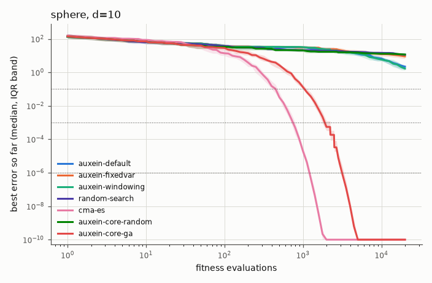

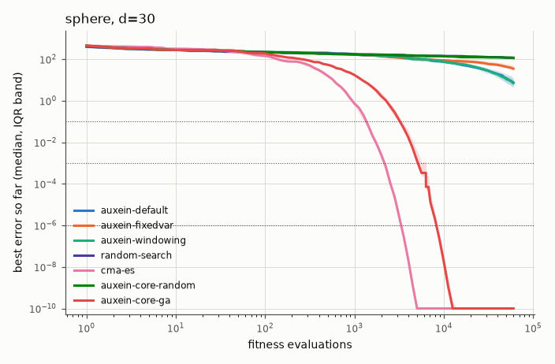

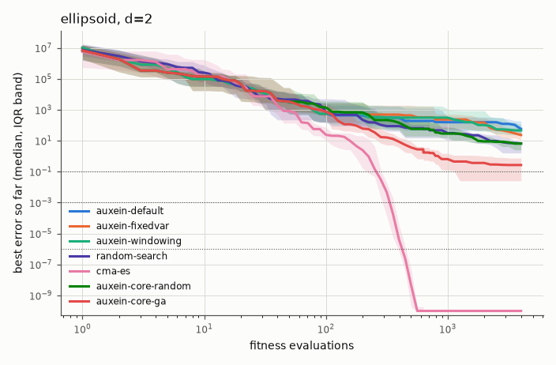

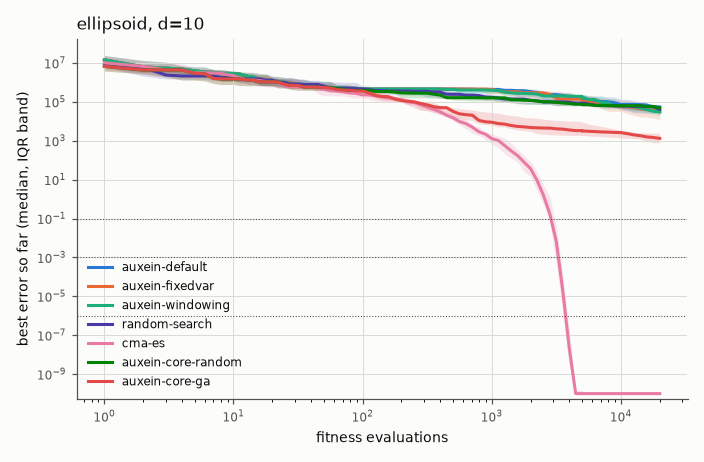

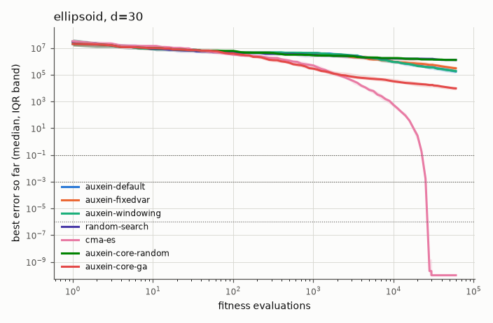

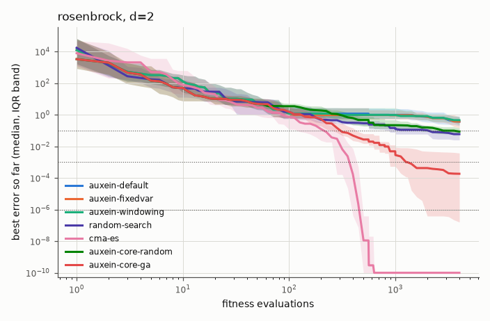

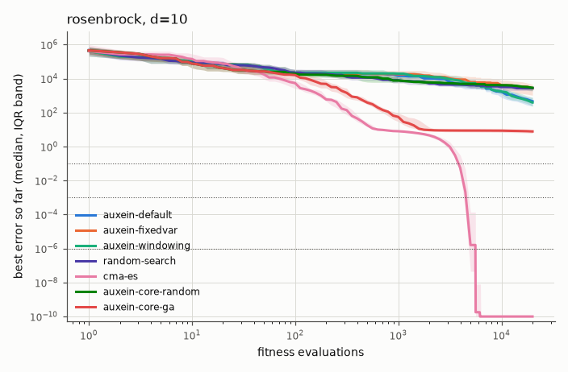

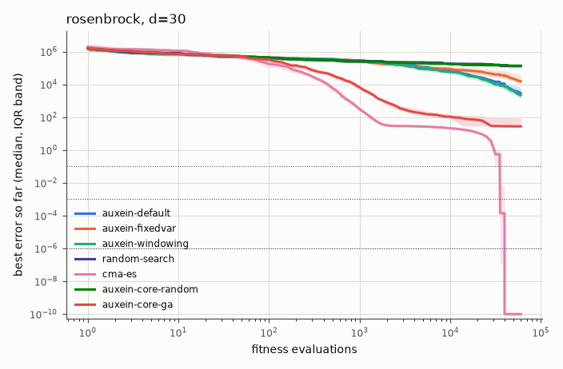

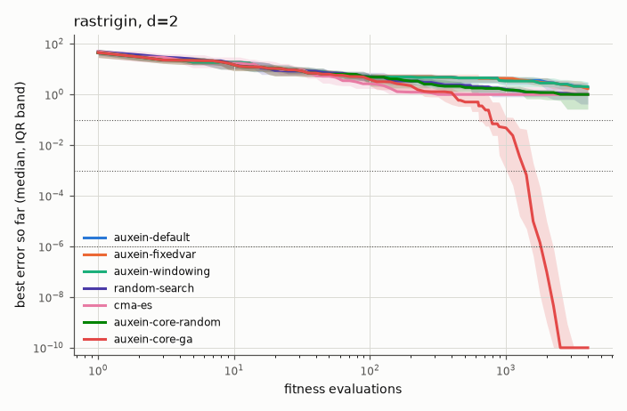

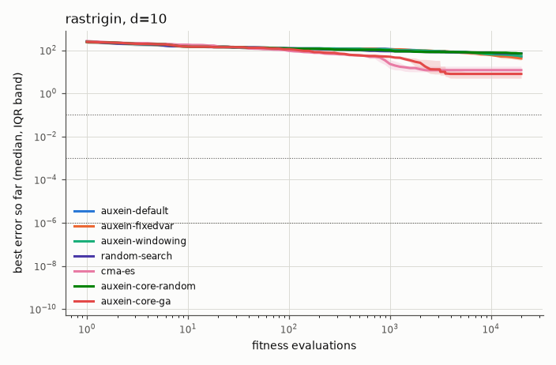

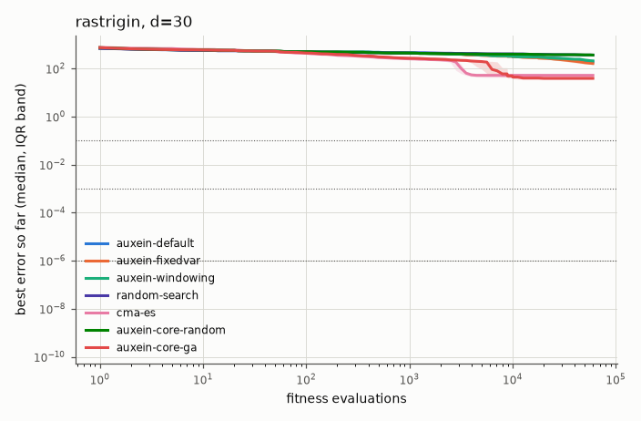

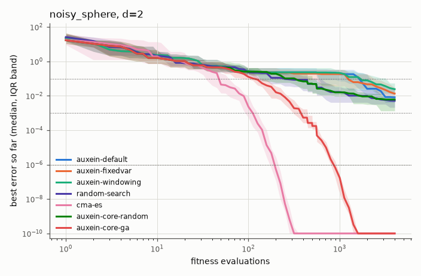


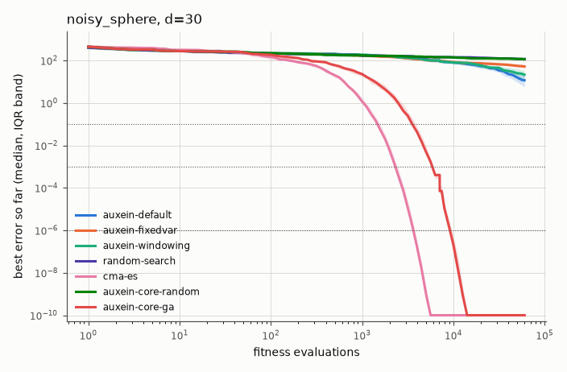

## 2. Summary

Final error, success rate per precision target (runs that reached it) and expected running time (ERT, in evaluations).

### sphere, d=2

| Algorithm | Final error, median [IQR] | Success 0.1 | Success 0.001 | Success 1e-06 | ERT 0.1 | ERT 0.001 | ERT 1e-06 |
|---|---|---|---|---|---|---|---|
| auxein-default | 0.01 [1.96e-03, 0.0329] | 25/25 | 1/25 | 0/25 | 1,784 | 99,951 | ∞ |
| auxein-fixedvar | 8.10e-03 [2.98e-03, 0.0187] | 22/25 | 1/25 | 0/25 | 1,850 | 99,845 | ∞ |
| auxein-windowing | 0.0242 [7.23e-03, 0.056] | 21/25 | 1/25 | 0/25 | 2,381 | 99,326 | ∞ |
| random-search | 5.14e-03 [2.11e-03, 6.64e-03] | 25/25 | 3/25 | 0/25 | 334 | 29,733 | ∞ |
| cma-es | 2.28e-16 [7.91e-17, 1.18e-15] | 25/25 | 25/25 | 25/25 | 48 | 105 | 193 |
| auxein-core-random | 6.09e-03 [1.32e-03, 0.0104] | 25/25 | 4/25 | 0/25 | 374 | 22,010 | ∞ |
| auxein-core-ga | 5.19e-25 [3.00e-25, 1.76e-24] | 25/25 | 25/25 | 25/25 | 99 | 320 | 846 |

### sphere, d=10

| Algorithm | Final error, median [IQR] | Success 0.1 | Success 0.001 | Success 1e-06 | ERT 0.1 | ERT 0.001 | ERT 1e-06 |
|---|---|---|---|---|---|---|---|
| auxein-default | 2.19 [1.51, 2.77] | 0/25 | 0/25 | 0/25 | ∞ | ∞ | ∞ |
| auxein-fixedvar | 9.03 [6.59, 12.5] | 0/25 | 0/25 | 0/25 | ∞ | ∞ | ∞ |
| auxein-windowing | 1.68 [1.34, 2.11] | 0/25 | 0/25 | 0/25 | ∞ | ∞ | ∞ |
| random-search | 11.3 [9.1, 14.1] | 0/25 | 0/25 | 0/25 | ∞ | ∞ | ∞ |
| cma-es | 1.72e-14 [1.12e-14, 2.79e-14] | 25/25 | 25/25 | 25/25 | 444 | 759 | 1,218 |
| auxein-core-random | 11.7 [9.22, 13.2] | 0/25 | 0/25 | 0/25 | ∞ | ∞ | ∞ |
| auxein-core-ga | 1.16e-22 [1.05e-22, 1.31e-22] | 25/25 | 25/25 | 25/25 | 1,080 | 1,920 | 3,186 |

### sphere, d=30

| Algorithm | Final error, median [IQR] | Success 0.1 | Success 0.001 | Success 1e-06 | ERT 0.1 | ERT 0.001 | ERT 1e-06 |
|---|---|---|---|---|---|---|---|
| auxein-default | 7.58 [4.28, 12.8] | 0/25 | 0/25 | 0/25 | ∞ | ∞ | ∞ |
| auxein-fixedvar | 34.9 [32.2, 52.2] | 0/25 | 0/25 | 0/25 | ∞ | ∞ | ∞ |
| auxein-windowing | 6.98 [5.16, 10.2] | 0/25 | 0/25 | 0/25 | ∞ | ∞ | ∞ |
| random-search | 118 [112, 131] | 0/25 | 0/25 | 0/25 | ∞ | ∞ | ∞ |
| cma-es | 2.84e-14 [2.41e-14, 3.36e-14] | 25/25 | 25/25 | 25/25 | 1,354 | 2,138 | 3,311 |
| auxein-core-random | 114 [107, 123] | 0/25 | 0/25 | 0/25 | ∞ | ∞ | ∞ |
| auxein-core-ga | 1.25e-21 [1.14e-21, 1.30e-21] | 25/25 | 25/25 | 25/25 | 3,298 | 5,274 | 8,276 |

### ellipsoid, d=2

| Algorithm | Final error, median [IQR] | Success 0.1 | Success 0.001 | Success 1e-06 | ERT 0.1 | ERT 0.001 | ERT 1e-06 |
|---|---|---|---|---|---|---|---|
| auxein-default | 58.2 [29.5, 189] | 0/25 | 0/25 | 0/25 | ∞ | ∞ | ∞ |
| auxein-fixedvar | 23.4 [11.1, 60.6] | 0/25 | 0/25 | 0/25 | ∞ | ∞ | ∞ |
| auxein-windowing | 46.5 [24.2, 109] | 0/25 | 0/25 | 0/25 | ∞ | ∞ | ∞ |
| random-search | 6.66 [1.62, 8.28] | 0/25 | 0/25 | 0/25 | ∞ | ∞ | ∞ |
| cma-es | 2.26e-16 [1.02e-16, 5.65e-16] | 25/25 | 25/25 | 25/25 | 253 | 329 | 422 |
| auxein-core-random | 6.54 [2.55, 9.09] | 0/25 | 0/25 | 0/25 | ∞ | ∞ | ∞ |
| auxein-core-ga | 0.27 [0.0255, 0.767] | 8/25 | 3/25 | 2/25 | 9,362 | 30,694 | 47,904 |

### ellipsoid, d=10

| Algorithm | Final error, median [IQR] | Success 0.1 | Success 0.001 | Success 1e-06 | ERT 0.1 | ERT 0.001 | ERT 1e-06 |
|---|---|---|---|---|---|---|---|
| auxein-default | 5.48e+04 [2.58e+04, 7.41e+04] | 0/25 | 0/25 | 0/25 | ∞ | ∞ | ∞ |
| auxein-fixedvar | 3.08e+04 [1.25e+04, 6.45e+04] | 0/25 | 0/25 | 0/25 | ∞ | ∞ | ∞ |
| auxein-windowing | 3.08e+04 [1.92e+04, 5.88e+04] | 0/25 | 0/25 | 0/25 | ∞ | ∞ | ∞ |
| random-search | 4.11e+04 [3.11e+04, 6.28e+04] | 0/25 | 0/25 | 0/25 | ∞ | ∞ | ∞ |
| cma-es | 1.50e-14 [9.83e-15, 2.26e-14] | 25/25 | 25/25 | 25/25 | 2,892 | 3,275 | 3,727 |
| auxein-core-random | 4.91e+04 [3.99e+04, 7.16e+04] | 0/25 | 0/25 | 0/25 | ∞ | ∞ | ∞ |
| auxein-core-ga | 1.33e+03 [790, 2.42e+03] | 0/25 | 0/25 | 0/25 | ∞ | ∞ | ∞ |

### ellipsoid, d=30

| Algorithm | Final error, median [IQR] | Success 0.1 | Success 0.001 | Success 1e-06 | ERT 0.1 | ERT 0.001 | ERT 1e-06 |
|---|---|---|---|---|---|---|---|
| auxein-default | 1.79e+05 [1.34e+05, 2.57e+05] | 0/25 | 0/25 | 0/25 | ∞ | ∞ | ∞ |
| auxein-fixedvar | 3.06e+05 [2.18e+05, 4.34e+05] | 0/25 | 0/25 | 0/25 | ∞ | ∞ | ∞ |
| auxein-windowing | 1.88e+05 [1.49e+05, 2.85e+05] | 0/25 | 0/25 | 0/25 | ∞ | ∞ | ∞ |
| random-search | 1.28e+06 [1.06e+06, 1.44e+06] | 0/25 | 0/25 | 0/25 | ∞ | ∞ | ∞ |
| cma-es | 2.34e-14 [1.95e-14, 2.83e-14] | 25/25 | 25/25 | 25/25 | 22,601 | 25,046 | 26,711 |
| auxein-core-random | 1.29e+06 [1.19e+06, 1.52e+06] | 0/25 | 0/25 | 0/25 | ∞ | ∞ | ∞ |
| auxein-core-ga | 9.58e+03 [7.2e+03, 1.26e+04] | 0/25 | 0/25 | 0/25 | ∞ | ∞ | ∞ |

### rosenbrock, d=2

| Algorithm | Final error, median [IQR] | Success 0.1 | Success 0.001 | Success 1e-06 | ERT 0.1 | ERT 0.001 | ERT 1e-06 |
|---|---|---|---|---|---|---|---|
| auxein-default | 0.373 [0.205, 0.828] | 5/25 | 1/25 | 0/25 | 18,057 | 97,350 | ∞ |
| auxein-fixedvar | 0.373 [0.145, 0.75] | 4/25 | 0/25 | 0/25 | 23,468 | ∞ | ∞ |
| auxein-windowing | 0.457 [0.24, 0.75] | 2/25 | 0/25 | 0/25 | 49,378 | ∞ | ∞ |
| random-search | 0.0597 [0.0256, 0.0843] | 20/25 | 0/25 | 0/25 | 2,665 | ∞ | ∞ |
| cma-es | 4.75e-16 [5.27e-17, 8.25e-16] | 25/25 | 25/25 | 25/25 | 228 | 376 | 470 |
| auxein-core-random | 0.0874 [0.0616, 0.148] | 16/25 | 0/25 | 0/25 | 4,135 | ∞ | ∞ |
| auxein-core-ga | 1.85e-04 [1.63e-07, 3.82e-03] | 25/25 | 16/25 | 9/25 | 447 | 3,312 | 8,998 |

### rosenbrock, d=10

| Algorithm | Final error, median [IQR] | Success 0.1 | Success 0.001 | Success 1e-06 | ERT 0.1 | ERT 0.001 | ERT 1e-06 |
|---|---|---|---|---|---|---|---|
| auxein-default | 466 [249, 765] | 0/25 | 0/25 | 0/25 | ∞ | ∞ | ∞ |
| auxein-fixedvar | 2.69e+03 [1.06e+03, 4.6e+03] | 0/25 | 0/25 | 0/25 | ∞ | ∞ | ∞ |
| auxein-windowing | 395 [228, 790] | 0/25 | 0/25 | 0/25 | ∞ | ∞ | ∞ |
| random-search | 2.74e+03 [1.89e+03, 3.74e+03] | 0/25 | 0/25 | 0/25 | ∞ | ∞ | ∞ |
| cma-es | 1.66e-14 [8.25e-15, 2.20e-14] | 24/25 | 24/25 | 24/25 | 4,402 | 4,994 | 5,477 |
| auxein-core-random | 2.91e+03 [2.01e+03, 3.34e+03] | 0/25 | 0/25 | 0/25 | ∞ | ∞ | ∞ |
| auxein-core-ga | 7.83 [6.11, 9.32] | 0/25 | 0/25 | 0/25 | ∞ | ∞ | ∞ |

### rosenbrock, d=30

| Algorithm | Final error, median [IQR] | Success 0.1 | Success 0.001 | Success 1e-06 | ERT 0.1 | ERT 0.001 | ERT 1e-06 |
|---|---|---|---|---|---|---|---|
| auxein-default | 2.85e+03 [1.55e+03, 5.96e+03] | 0/25 | 0/25 | 0/25 | ∞ | ∞ | ∞ |
| auxein-fixedvar | 1.51e+04 [1.08e+04, 3.37e+04] | 0/25 | 0/25 | 0/25 | ∞ | ∞ | ∞ |
| auxein-windowing | 2.21e+03 [1.34e+03, 3.92e+03] | 0/25 | 0/25 | 0/25 | ∞ | ∞ | ∞ |
| random-search | 1.29e+05 [1.15e+05, 1.58e+05] | 0/25 | 0/25 | 0/25 | ∞ | ∞ | ∞ |
| cma-es | 3.71e-14 [2.44e-14, 4.63e-14] | 20/25 | 20/25 | 20/25 | 41,642 | 43,466 | 44,986 |
| auxein-core-random | 1.36e+05 [1.15e+05, 1.49e+05] | 0/25 | 0/25 | 0/25 | ∞ | ∞ | ∞ |
| auxein-core-ga | 27.5 [26.8, 87.4] | 0/25 | 0/25 | 0/25 | ∞ | ∞ | ∞ |

### rastrigin, d=2

| Algorithm | Final error, median [IQR] | Success 0.1 | Success 0.001 | Success 1e-06 | ERT 0.1 | ERT 0.001 | ERT 1e-06 |
|---|---|---|---|---|---|---|---|
| auxein-default | 1.84 [1.17, 2.95] | 1/25 | 0/25 | 0/25 | 99,430 | ∞ | ∞ |
| auxein-fixedvar | 1.69 [1.12, 2.57] | 0/25 | 0/25 | 0/25 | ∞ | ∞ | ∞ |
| auxein-windowing | 2.01 [0.928, 3.17] | 0/25 | 0/25 | 0/25 | ∞ | ∞ | ∞ |
| random-search | 0.995 [0.415, 1.15] | 1/25 | 0/25 | 0/25 | 96,447 | ∞ | ∞ |
| cma-es | 0.995 [0.995, 1.99] | 4/25 | 4/25 | 4/25 | 3,546 | 3,601 | 3,710 |
| auxein-core-random | 0.998 [0.262, 1.28] | 1/25 | 0/25 | 0/25 | 98,392 | ∞ | ∞ |
| auxein-core-ga | 0 [0, 0] | 23/25 | 23/25 | 23/25 | 1,241 | 1,773 | 2,265 |

### rastrigin, d=10

| Algorithm | Final error, median [IQR] | Success 0.1 | Success 0.001 | Success 1e-06 | ERT 0.1 | ERT 0.001 | ERT 1e-06 |
|---|---|---|---|---|---|---|---|
| auxein-default | 51.1 [47.3, 60.4] | 0/25 | 0/25 | 0/25 | ∞ | ∞ | ∞ |
| auxein-fixedvar | 41.5 [34.2, 47.3] | 0/25 | 0/25 | 0/25 | ∞ | ∞ | ∞ |
| auxein-windowing | 52.2 [41.7, 57.3] | 0/25 | 0/25 | 0/25 | ∞ | ∞ | ∞ |
| random-search | 70.8 [66.2, 75.5] | 0/25 | 0/25 | 0/25 | ∞ | ∞ | ∞ |
| cma-es | 11.9 [9.95, 17.9] | 0/25 | 0/25 | 0/25 | ∞ | ∞ | ∞ |
| auxein-core-random | 69.4 [65.7, 75.5] | 0/25 | 0/25 | 0/25 | ∞ | ∞ | ∞ |
| auxein-core-ga | 7.96 [4.97, 9.95] | 0/25 | 0/25 | 0/25 | ∞ | ∞ | ∞ |

### rastrigin, d=30

| Algorithm | Final error, median [IQR] | Success 0.1 | Success 0.001 | Success 1e-06 | ERT 0.1 | ERT 0.001 | ERT 1e-06 |
|---|---|---|---|---|---|---|---|
| auxein-default | 191 [137, 229] | 0/25 | 0/25 | 0/25 | ∞ | ∞ | ∞ |
| auxein-fixedvar | 161 [151, 176] | 0/25 | 0/25 | 0/25 | ∞ | ∞ | ∞ |
| auxein-windowing | 207 [154, 225] | 0/25 | 0/25 | 0/25 | ∞ | ∞ | ∞ |
| random-search | 362 [354, 377] | 0/25 | 0/25 | 0/25 | ∞ | ∞ | ∞ |
| cma-es | 51.7 [42.8, 58.7] | 0/25 | 0/25 | 0/25 | ∞ | ∞ | ∞ |
| auxein-core-random | 361 [343, 375] | 0/25 | 0/25 | 0/25 | ∞ | ∞ | ∞ |
| auxein-core-ga | 38.8 [34.8, 44.8] | 0/25 | 0/25 | 0/25 | ∞ | ∞ | ∞ |

### noisy_sphere, d=2

| Algorithm | Final error, median [IQR] | Success 0.1 | Success 0.001 | Success 1e-06 | ERT 0.1 | ERT 0.001 | ERT 1e-06 |
|---|---|---|---|---|---|---|---|
| auxein-default | 8.15e-03 [4.08e-03, 0.0281] | 24/25 | 0/25 | 0/25 | 1,622 | ∞ | ∞ |
| auxein-fixedvar | 0.0134 [8.01e-03, 0.0298] | 22/25 | 0/25 | 0/25 | 1,698 | ∞ | ∞ |
| auxein-windowing | 0.0243 [0.0119, 0.0542] | 22/25 | 1/25 | 0/25 | 2,053 | 96,622 | ∞ |
| random-search | 5.14e-03 [2.11e-03, 6.64e-03] | 25/25 | 3/25 | 0/25 | 334 | 29,733 | ∞ |
| cma-es | 3.06e-16 [1.09e-16, 5.64e-16] | 25/25 | 25/25 | 25/25 | 47 | 108 | 193 |
| auxein-core-random | 6.09e-03 [1.32e-03, 0.0104] | 25/25 | 4/25 | 0/25 | 374 | 22,010 | ∞ |
| auxein-core-ga | 7.92e-25 [4.29e-25, 1.39e-24] | 25/25 | 25/25 | 25/25 | 106 | 363 | 852 |

### noisy_sphere, d=10

| Algorithm | Final error, median [IQR] | Success 0.1 | Success 0.001 | Success 1e-06 | ERT 0.1 | ERT 0.001 | ERT 1e-06 |
|---|---|---|---|---|---|---|---|
| auxein-default | 2.26 [1.27, 2.76] | 0/25 | 0/25 | 0/25 | ∞ | ∞ | ∞ |
| auxein-fixedvar | 9.41 [7.12, 12.4] | 0/25 | 0/25 | 0/25 | ∞ | ∞ | ∞ |
| auxein-windowing | 2.5 [1.3, 3.69] | 0/25 | 0/25 | 0/25 | ∞ | ∞ | ∞ |
| random-search | 11.3 [9.1, 14.1] | 0/25 | 0/25 | 0/25 | ∞ | ∞ | ∞ |
| cma-es | 1.73e-14 [9.87e-15, 2.61e-14] | 25/25 | 25/25 | 25/25 | 454 | 761 | 1,220 |
| auxein-core-random | 11.7 [9.22, 13.2] | 0/25 | 0/25 | 0/25 | ∞ | ∞ | ∞ |
| auxein-core-ga | 1.04e-22 [7.19e-23, 1.15e-22] | 25/25 | 25/25 | 25/25 | 1,085 | 1,955 | 3,256 |

### noisy_sphere, d=30

| Algorithm | Final error, median [IQR] | Success 0.1 | Success 0.001 | Success 1e-06 | ERT 0.1 | ERT 0.001 | ERT 1e-06 |
|---|---|---|---|---|---|---|---|
| auxein-default | 11.7 [5.62, 19.9] | 0/25 | 0/25 | 0/25 | ∞ | ∞ | ∞ |
| auxein-fixedvar | 52.5 [42.5, 63.8] | 0/25 | 0/25 | 0/25 | ∞ | ∞ | ∞ |
| auxein-windowing | 21.4 [9.69, 32] | 0/25 | 0/25 | 0/25 | ∞ | ∞ | ∞ |
| random-search | 118 [112, 131] | 0/25 | 0/25 | 0/25 | ∞ | ∞ | ∞ |
| cma-es | 4.25e-14 [3.51e-14, 5.44e-14] | 25/25 | 25/25 | 25/25 | 1,503 | 2,356 | 3,661 |
| auxein-core-random | 114 [107, 123] | 0/25 | 0/25 | 0/25 | ∞ | ∞ | ∞ |
| auxein-core-ga | 1.22e-21 [1.12e-21, 1.31e-21] | 25/25 | 25/25 | 25/25 | 3,679 | 5,935 | 9,318 |

### Mean rank

Rank of each algorithm by the median final error in each problem × dimension (1 = best), and the mean rank.

| Algorithm | sphere d=2 | sphere d=10 | sphere d=30 | ellipsoid d=2 | ellipsoid d=10 | ellipsoid d=30 | rosenbrock d=2 | rosenbrock d=10 | rosenbrock d=30 | rastrigin d=2 | rastrigin d=10 | rastrigin d=30 | noisy_sphere d=2 | noisy_sphere d=10 | noisy_sphere d=30 | Mean rank |
|---|---|---|---|---|---|---|---|---|---|---|---|---|---|---|---|---|
| auxein-core-ga | 1 | 1 | 1 | 2 | 2 | 2 | 2 | 2 | 2 | 1 | 1 | 1 | 1 | 1 | 1 | 1.40 |
| cma-es | 2 | 2 | 2 | 1 | 1 | 1 | 1 | 1 | 1 | 2 | 2 | 2 | 2 | 2 | 2 | 1.60 |
| auxein-default | 6 | 4 | 4 | 7 | 7 | 3 | 5 | 4 | 4 | 6 | 4 | 4 | 5 | 3 | 3 | 4.60 |
| auxein-fixedvar | 5 | 5 | 5 | 5 | 3 | 5 | 6 | 5 | 5 | 5 | 3 | 3 | 6 | 5 | 5 | 4.73 |
| auxein-windowing | 7 | 3 | 3 | 6 | 4 | 4 | 7 | 3 | 3 | 7 | 5 | 5 | 7 | 4 | 4 | 4.80 |
| random-search | 3 | 6 | 7 | 4 | 5 | 6 | 3 | 6 | 6 | 3 | 7 | 7 | 3 | 6 | 7 | 5.27 |
| auxein-core-random | 4 | 7 | 6 | 3 | 6 | 7 | 4 | 7 | 7 | 4 | 6 | 6 | 4 | 7 | 6 | 5.60 |

## 3. Statistical comparison

Final error of the reference (`auxein-default`, `auxein-core-ga`) against every other algorithm: two-sided Mann-Whitney U with Holm correction within each table, and the Vargha-Delaney A12 effect size (the probability that the reference wins).

### Reference: `auxein-default`

#### sphere, d=2

| auxein-default vs | median error (auxein-default) | median error (other) | A12 | p | p (Holm) | Reading |
|---|---|---|---|---|---|---|
| auxein-fixedvar | 0.01 | 8.10e-03 | 0.45 | 0.59 | 0.59 | no significant difference (negligible effect) |
| auxein-windowing | 0.01 | 0.0242 | 0.61 | 0.19 | 0.38 | no significant difference (small effect) |
| random-search | 0.01 | 5.14e-03 | 0.33 | 0.046 | 0.18 | no significant difference (medium effect) |
| cma-es | 0.01 | 2.28e-16 | 0.00 | 1.4e-09 | 8.5e-09 | cma-es better, large effect |
| auxein-core-random | 0.01 | 6.09e-03 | 0.34 | 0.057 | 0.18 | no significant difference (medium effect) |
| auxein-core-ga | 0.01 | 5.19e-25 | 0.00 | 1.4e-09 | 8.5e-09 | auxein-core-ga better, large effect |

#### sphere, d=10

| auxein-default vs | median error (auxein-default) | median error (other) | A12 | p | p (Holm) | Reading |
|---|---|---|---|---|---|---|
| auxein-fixedvar | 2.19 | 9.03 | 0.97 | 1.2e-08 | 2.3e-08 | auxein-default better, large effect |
| auxein-windowing | 2.19 | 1.68 | 0.40 | 0.24 | 0.24 | no significant difference (small effect) |
| random-search | 2.19 | 11.3 | 1.00 | 1.4e-09 | 8.5e-09 | auxein-default better, large effect |
| cma-es | 2.19 | 1.72e-14 | 0.00 | 1.4e-09 | 8.5e-09 | cma-es better, large effect |
| auxein-core-random | 2.19 | 11.7 | 1.00 | 1.4e-09 | 8.5e-09 | auxein-default better, large effect |
| auxein-core-ga | 2.19 | 1.16e-22 | 0.00 | 1.4e-09 | 8.5e-09 | auxein-core-ga better, large effect |

#### sphere, d=30

| auxein-default vs | median error (auxein-default) | median error (other) | A12 | p | p (Holm) | Reading |
|---|---|---|---|---|---|---|
| auxein-fixedvar | 7.58 | 34.9 | 0.97 | 9.3e-09 | 1.9e-08 | auxein-default better, large effect |
| auxein-windowing | 7.58 | 6.98 | 0.49 | 0.95 | 0.95 | no significant difference (negligible effect) |
| random-search | 7.58 | 118 | 1.00 | 1.4e-09 | 8.5e-09 | auxein-default better, large effect |
| cma-es | 7.58 | 2.84e-14 | 0.00 | 1.4e-09 | 8.5e-09 | cma-es better, large effect |
| auxein-core-random | 7.58 | 114 | 1.00 | 1.4e-09 | 8.5e-09 | auxein-default better, large effect |
| auxein-core-ga | 7.58 | 1.25e-21 | 0.00 | 1.4e-09 | 8.5e-09 | auxein-core-ga better, large effect |

#### ellipsoid, d=2

| auxein-default vs | median error (auxein-default) | median error (other) | A12 | p | p (Holm) | Reading |
|---|---|---|---|---|---|---|
| auxein-fixedvar | 58.2 | 23.4 | 0.30 | 0.014 | 0.029 | auxein-fixedvar better, medium effect |
| auxein-windowing | 58.2 | 46.5 | 0.44 | 0.46 | 0.46 | no significant difference (small effect) |
| random-search | 58.2 | 6.66 | 0.09 | 9.2e-07 | 2.7e-06 | random-search better, large effect |
| cma-es | 58.2 | 2.26e-16 | 0.00 | 1.4e-09 | 8.5e-09 | cma-es better, large effect |
| auxein-core-random | 58.2 | 6.54 | 0.08 | 5e-07 | 2e-06 | auxein-core-random better, large effect |
| auxein-core-ga | 58.2 | 0.27 | 0.02 | 7.4e-09 | 3.7e-08 | auxein-core-ga better, large effect |

#### ellipsoid, d=10

| auxein-default vs | median error (auxein-default) | median error (other) | A12 | p | p (Holm) | Reading |
|---|---|---|---|---|---|---|
| auxein-fixedvar | 5.48e+04 | 3.08e+04 | 0.38 | 0.15 | 0.58 | no significant difference (small effect) |
| auxein-windowing | 5.48e+04 | 3.08e+04 | 0.40 | 0.24 | 0.73 | no significant difference (small effect) |
| random-search | 5.48e+04 | 4.11e+04 | 0.48 | 0.8 | 1 | no significant difference (negligible effect) |
| cma-es | 5.48e+04 | 1.50e-14 | 0.00 | 1.4e-09 | 8.5e-09 | cma-es better, large effect |
| auxein-core-random | 5.48e+04 | 4.91e+04 | 0.55 | 0.56 | 1 | no significant difference (negligible effect) |
| auxein-core-ga | 5.48e+04 | 1.33e+03 | 0.00 | 1.4e-09 | 8.5e-09 | auxein-core-ga better, large effect |

#### ellipsoid, d=30

| auxein-default vs | median error (auxein-default) | median error (other) | A12 | p | p (Holm) | Reading |
|---|---|---|---|---|---|---|
| auxein-fixedvar | 1.79e+05 | 3.06e+05 | 0.72 | 0.0079 | 0.016 | auxein-default better, large effect |
| auxein-windowing | 1.79e+05 | 1.88e+05 | 0.57 | 0.4 | 0.4 | no significant difference (small effect) |
| random-search | 1.79e+05 | 1.28e+06 | 1.00 | 1.4e-09 | 8.5e-09 | auxein-default better, large effect |
| cma-es | 1.79e+05 | 2.34e-14 | 0.00 | 1.4e-09 | 8.5e-09 | cma-es better, large effect |
| auxein-core-random | 1.79e+05 | 1.29e+06 | 1.00 | 1.4e-09 | 8.5e-09 | auxein-default better, large effect |
| auxein-core-ga | 1.79e+05 | 9.58e+03 | 0.00 | 1.4e-09 | 8.5e-09 | auxein-core-ga better, large effect |

#### rosenbrock, d=2

| auxein-default vs | median error (auxein-default) | median error (other) | A12 | p | p (Holm) | Reading |
|---|---|---|---|---|---|---|
| auxein-fixedvar | 0.373 | 0.373 | 0.50 | 0.97 | 1 | no significant difference (negligible effect) |
| auxein-windowing | 0.373 | 0.457 | 0.54 | 0.59 | 1 | no significant difference (negligible effect) |
| random-search | 0.373 | 0.0597 | 0.15 | 2e-05 | 7.9e-05 | random-search better, large effect |
| cma-es | 0.373 | 4.75e-16 | 0.00 | 1.4e-09 | 8.5e-09 | cma-es better, large effect |
| auxein-core-random | 0.373 | 0.0874 | 0.18 | 0.0001 | 0.00031 | auxein-core-random better, large effect |
| auxein-core-ga | 0.373 | 1.85e-04 | 0.04 | 2.1e-08 | 1e-07 | auxein-core-ga better, large effect |

#### rosenbrock, d=10

| auxein-default vs | median error (auxein-default) | median error (other) | A12 | p | p (Holm) | Reading |
|---|---|---|---|---|---|---|
| auxein-fixedvar | 466 | 2.69e+03 | 0.92 | 2.7e-07 | 5.4e-07 | auxein-default better, large effect |
| auxein-windowing | 466 | 395 | 0.51 | 0.88 | 0.88 | no significant difference (negligible effect) |
| random-search | 466 | 2.74e+03 | 1.00 | 1.4e-09 | 8.5e-09 | auxein-default better, large effect |
| cma-es | 466 | 1.66e-14 | 0.00 | 1.4e-09 | 8.5e-09 | cma-es better, large effect |
| auxein-core-random | 466 | 2.91e+03 | 1.00 | 2e-09 | 8.5e-09 | auxein-default better, large effect |
| auxein-core-ga | 466 | 7.83 | 0.00 | 1.4e-09 | 8.5e-09 | auxein-core-ga better, large effect |

#### rosenbrock, d=30

| auxein-default vs | median error (auxein-default) | median error (other) | A12 | p | p (Holm) | Reading |
|---|---|---|---|---|---|---|
| auxein-fixedvar | 2.85e+03 | 1.51e+04 | 0.96 | 3.6e-08 | 7.2e-08 | auxein-default better, large effect |
| auxein-windowing | 2.85e+03 | 2.21e+03 | 0.45 | 0.56 | 0.56 | no significant difference (negligible effect) |
| random-search | 2.85e+03 | 1.29e+05 | 1.00 | 1.4e-09 | 8.5e-09 | auxein-default better, large effect |
| cma-es | 2.85e+03 | 3.71e-14 | 0.00 | 1.4e-09 | 8.5e-09 | cma-es better, large effect |
| auxein-core-random | 2.85e+03 | 1.36e+05 | 1.00 | 1.4e-09 | 8.5e-09 | auxein-default better, large effect |
| auxein-core-ga | 2.85e+03 | 27.5 | 0.00 | 1.4e-09 | 8.5e-09 | auxein-core-ga better, large effect |

#### rastrigin, d=2

| auxein-default vs | median error (auxein-default) | median error (other) | A12 | p | p (Holm) | Reading |
|---|---|---|---|---|---|---|
| auxein-fixedvar | 1.84 | 1.69 | 0.50 | 0.96 | 1 | no significant difference (negligible effect) |
| auxein-windowing | 1.84 | 2.01 | 0.53 | 0.71 | 1 | no significant difference (negligible effect) |
| random-search | 1.84 | 0.995 | 0.20 | 0.00033 | 0.0017 | random-search better, large effect |
| cma-es | 1.84 | 0.995 | 0.37 | 0.12 | 0.36 | no significant difference (small effect) |
| auxein-core-random | 1.84 | 0.998 | 0.23 | 0.00097 | 0.0039 | auxein-core-random better, large effect |
| auxein-core-ga | 1.84 | 0 | 0.02 | 1.4e-09 | 8.4e-09 | auxein-core-ga better, large effect |

#### rastrigin, d=10

| auxein-default vs | median error (auxein-default) | median error (other) | A12 | p | p (Holm) | Reading |
|---|---|---|---|---|---|---|
| auxein-fixedvar | 51.1 | 41.5 | 0.21 | 0.00051 | 0.001 | auxein-fixedvar better, large effect |
| auxein-windowing | 51.1 | 52.2 | 0.41 | 0.28 | 0.28 | no significant difference (small effect) |
| random-search | 51.1 | 70.8 | 0.91 | 8.3e-07 | 2.5e-06 | auxein-default better, large effect |
| cma-es | 51.1 | 11.9 | 0.00 | 1.6e-09 | 8.4e-09 | cma-es better, large effect |
| auxein-core-random | 51.1 | 69.4 | 0.92 | 3.7e-07 | 1.5e-06 | auxein-default better, large effect |
| auxein-core-ga | 51.1 | 7.96 | 0.00 | 1.4e-09 | 8.4e-09 | auxein-core-ga better, large effect |

#### rastrigin, d=30

| auxein-default vs | median error (auxein-default) | median error (other) | A12 | p | p (Holm) | Reading |
|---|---|---|---|---|---|---|
| auxein-fixedvar | 191 | 161 | 0.41 | 0.29 | 0.59 | no significant difference (small effect) |
| auxein-windowing | 191 | 207 | 0.52 | 0.86 | 0.86 | no significant difference (negligible effect) |
| random-search | 191 | 362 | 1.00 | 1.4e-09 | 8.5e-09 | auxein-default better, large effect |
| cma-es | 191 | 51.7 | 0.00 | 1.4e-09 | 8.5e-09 | cma-es better, large effect |
| auxein-core-random | 191 | 361 | 1.00 | 1.4e-09 | 8.5e-09 | auxein-default better, large effect |
| auxein-core-ga | 191 | 38.8 | 0.00 | 1.4e-09 | 8.5e-09 | auxein-core-ga better, large effect |

#### noisy_sphere, d=2

| auxein-default vs | median error (auxein-default) | median error (other) | A12 | p | p (Holm) | Reading |
|---|---|---|---|---|---|---|
| auxein-fixedvar | 8.15e-03 | 0.0134 | 0.60 | 0.25 | 0.25 | no significant difference (small effect) |
| auxein-windowing | 8.15e-03 | 0.0243 | 0.67 | 0.037 | 0.077 | no significant difference (medium effect) |
| random-search | 8.15e-03 | 5.14e-03 | 0.27 | 0.0052 | 0.021 | random-search better, large effect |
| cma-es | 8.15e-03 | 3.06e-16 | 0.00 | 1.4e-09 | 8.5e-09 | cma-es better, large effect |
| auxein-core-random | 8.15e-03 | 6.09e-03 | 0.32 | 0.026 | 0.077 | no significant difference (medium effect) |
| auxein-core-ga | 8.15e-03 | 7.92e-25 | 0.00 | 1.4e-09 | 8.5e-09 | auxein-core-ga better, large effect |

#### noisy_sphere, d=10

| auxein-default vs | median error (auxein-default) | median error (other) | A12 | p | p (Holm) | Reading |
|---|---|---|---|---|---|---|
| auxein-fixedvar | 2.26 | 9.41 | 0.96 | 2.3e-08 | 4.6e-08 | auxein-default better, large effect |
| auxein-windowing | 2.26 | 2.5 | 0.59 | 0.29 | 0.29 | no significant difference (small effect) |
| random-search | 2.26 | 11.3 | 1.00 | 1.8e-09 | 8.5e-09 | auxein-default better, large effect |
| cma-es | 2.26 | 1.73e-14 | 0.00 | 1.4e-09 | 8.5e-09 | cma-es better, large effect |
| auxein-core-random | 2.26 | 11.7 | 1.00 | 1.6e-09 | 8.5e-09 | auxein-default better, large effect |
| auxein-core-ga | 2.26 | 1.04e-22 | 0.00 | 1.4e-09 | 8.5e-09 | auxein-core-ga better, large effect |

#### noisy_sphere, d=30

| auxein-default vs | median error (auxein-default) | median error (other) | A12 | p | p (Holm) | Reading |
|---|---|---|---|---|---|---|
| auxein-fixedvar | 11.7 | 52.5 | 0.96 | 2.9e-08 | 5.7e-08 | auxein-default better, large effect |
| auxein-windowing | 11.7 | 21.4 | 0.66 | 0.048 | 0.048 | auxein-default better, medium effect |
| random-search | 11.7 | 118 | 1.00 | 1.4e-09 | 8.5e-09 | auxein-default better, large effect |
| cma-es | 11.7 | 4.25e-14 | 0.00 | 1.4e-09 | 8.5e-09 | cma-es better, large effect |
| auxein-core-random | 11.7 | 114 | 1.00 | 1.4e-09 | 8.5e-09 | auxein-default better, large effect |
| auxein-core-ga | 11.7 | 1.22e-21 | 0.00 | 1.4e-09 | 8.5e-09 | auxein-core-ga better, large effect |

### Reference: `auxein-core-ga`

#### sphere, d=2

| auxein-core-ga vs | median error (auxein-core-ga) | median error (other) | A12 | p | p (Holm) | Reading |
|---|---|---|---|---|---|---|
| auxein-default | 5.19e-25 | 0.01 | 1.00 | 1.4e-09 | 8.5e-09 | auxein-core-ga better, large effect |
| auxein-fixedvar | 5.19e-25 | 8.10e-03 | 1.00 | 1.4e-09 | 8.5e-09 | auxein-core-ga better, large effect |
| auxein-windowing | 5.19e-25 | 0.0242 | 1.00 | 1.4e-09 | 8.5e-09 | auxein-core-ga better, large effect |
| random-search | 5.19e-25 | 5.14e-03 | 1.00 | 1.4e-09 | 8.5e-09 | auxein-core-ga better, large effect |
| cma-es | 5.19e-25 | 2.28e-16 | 1.00 | 1.4e-09 | 8.5e-09 | auxein-core-ga better, large effect |
| auxein-core-random | 5.19e-25 | 6.09e-03 | 1.00 | 1.4e-09 | 8.5e-09 | auxein-core-ga better, large effect |

#### sphere, d=10

| auxein-core-ga vs | median error (auxein-core-ga) | median error (other) | A12 | p | p (Holm) | Reading |
|---|---|---|---|---|---|---|
| auxein-default | 1.16e-22 | 2.19 | 1.00 | 1.4e-09 | 8.5e-09 | auxein-core-ga better, large effect |
| auxein-fixedvar | 1.16e-22 | 9.03 | 1.00 | 1.4e-09 | 8.5e-09 | auxein-core-ga better, large effect |
| auxein-windowing | 1.16e-22 | 1.68 | 1.00 | 1.4e-09 | 8.5e-09 | auxein-core-ga better, large effect |
| random-search | 1.16e-22 | 11.3 | 1.00 | 1.4e-09 | 8.5e-09 | auxein-core-ga better, large effect |
| cma-es | 1.16e-22 | 1.72e-14 | 1.00 | 1.4e-09 | 8.5e-09 | auxein-core-ga better, large effect |
| auxein-core-random | 1.16e-22 | 11.7 | 1.00 | 1.4e-09 | 8.5e-09 | auxein-core-ga better, large effect |

#### sphere, d=30

| auxein-core-ga vs | median error (auxein-core-ga) | median error (other) | A12 | p | p (Holm) | Reading |
|---|---|---|---|---|---|---|
| auxein-default | 1.25e-21 | 7.58 | 1.00 | 1.4e-09 | 8.5e-09 | auxein-core-ga better, large effect |
| auxein-fixedvar | 1.25e-21 | 34.9 | 1.00 | 1.4e-09 | 8.5e-09 | auxein-core-ga better, large effect |
| auxein-windowing | 1.25e-21 | 6.98 | 1.00 | 1.4e-09 | 8.5e-09 | auxein-core-ga better, large effect |
| random-search | 1.25e-21 | 118 | 1.00 | 1.4e-09 | 8.5e-09 | auxein-core-ga better, large effect |
| cma-es | 1.25e-21 | 2.84e-14 | 1.00 | 1.4e-09 | 8.5e-09 | auxein-core-ga better, large effect |
| auxein-core-random | 1.25e-21 | 114 | 1.00 | 1.4e-09 | 8.5e-09 | auxein-core-ga better, large effect |

#### ellipsoid, d=2

| auxein-core-ga vs | median error (auxein-core-ga) | median error (other) | A12 | p | p (Holm) | Reading |
|---|---|---|---|---|---|---|
| auxein-default | 0.27 | 58.2 | 0.98 | 7.4e-09 | 3.7e-08 | auxein-core-ga better, large effect |
| auxein-fixedvar | 0.27 | 23.4 | 0.96 | 3.6e-08 | 1.1e-07 | auxein-core-ga better, large effect |
| auxein-windowing | 0.27 | 46.5 | 0.99 | 3.7e-09 | 2.2e-08 | auxein-core-ga better, large effect |
| random-search | 0.27 | 6.66 | 0.91 | 8.3e-07 | 8.3e-07 | auxein-core-ga better, large effect |
| cma-es | 0.27 | 2.26e-16 | 0.03 | 1.2e-08 | 4.7e-08 | cma-es better, large effect |
| auxein-core-random | 0.27 | 6.54 | 0.93 | 2.5e-07 | 4.9e-07 | auxein-core-ga better, large effect |

#### ellipsoid, d=10

| auxein-core-ga vs | median error (auxein-core-ga) | median error (other) | A12 | p | p (Holm) | Reading |
|---|---|---|---|---|---|---|
| auxein-default | 1.33e+03 | 5.48e+04 | 1.00 | 1.4e-09 | 8.5e-09 | auxein-core-ga better, large effect |
| auxein-fixedvar | 1.33e+03 | 3.08e+04 | 0.99 | 2.6e-09 | 8.5e-09 | auxein-core-ga better, large effect |
| auxein-windowing | 1.33e+03 | 3.08e+04 | 1.00 | 1.8e-09 | 8.5e-09 | auxein-core-ga better, large effect |
| random-search | 1.33e+03 | 4.11e+04 | 1.00 | 1.4e-09 | 8.5e-09 | auxein-core-ga better, large effect |
| cma-es | 1.33e+03 | 1.50e-14 | 0.00 | 1.4e-09 | 8.5e-09 | cma-es better, large effect |
| auxein-core-random | 1.33e+03 | 4.91e+04 | 1.00 | 1.4e-09 | 8.5e-09 | auxein-core-ga better, large effect |

#### ellipsoid, d=30

| auxein-core-ga vs | median error (auxein-core-ga) | median error (other) | A12 | p | p (Holm) | Reading |
|---|---|---|---|---|---|---|
| auxein-default | 9.58e+03 | 1.79e+05 | 1.00 | 1.4e-09 | 8.5e-09 | auxein-core-ga better, large effect |
| auxein-fixedvar | 9.58e+03 | 3.06e+05 | 1.00 | 1.4e-09 | 8.5e-09 | auxein-core-ga better, large effect |
| auxein-windowing | 9.58e+03 | 1.88e+05 | 1.00 | 1.4e-09 | 8.5e-09 | auxein-core-ga better, large effect |
| random-search | 9.58e+03 | 1.28e+06 | 1.00 | 1.4e-09 | 8.5e-09 | auxein-core-ga better, large effect |
| cma-es | 9.58e+03 | 2.34e-14 | 0.00 | 1.4e-09 | 8.5e-09 | cma-es better, large effect |
| auxein-core-random | 9.58e+03 | 1.29e+06 | 1.00 | 1.4e-09 | 8.5e-09 | auxein-core-ga better, large effect |

#### rosenbrock, d=2

| auxein-core-ga vs | median error (auxein-core-ga) | median error (other) | A12 | p | p (Holm) | Reading |
|---|---|---|---|---|---|---|
| auxein-default | 1.85e-04 | 0.373 | 0.96 | 2.1e-08 | 4.1e-08 | auxein-core-ga better, large effect |
| auxein-fixedvar | 1.85e-04 | 0.373 | 1.00 | 1.6e-09 | 8.5e-09 | auxein-core-ga better, large effect |
| auxein-windowing | 1.85e-04 | 0.457 | 1.00 | 1.4e-09 | 8.5e-09 | auxein-core-ga better, large effect |
| random-search | 1.85e-04 | 0.0597 | 0.97 | 1e-08 | 3.1e-08 | auxein-core-ga better, large effect |
| cma-es | 1.85e-04 | 4.75e-16 | 0.07 | 1.5e-07 | 1.5e-07 | cma-es better, large effect |
| auxein-core-random | 1.85e-04 | 0.0874 | 0.99 | 2.9e-09 | 1.2e-08 | auxein-core-ga better, large effect |

#### rosenbrock, d=10

| auxein-core-ga vs | median error (auxein-core-ga) | median error (other) | A12 | p | p (Holm) | Reading |
|---|---|---|---|---|---|---|
| auxein-default | 7.83 | 466 | 1.00 | 1.4e-09 | 8.5e-09 | auxein-core-ga better, large effect |
| auxein-fixedvar | 7.83 | 2.69e+03 | 1.00 | 1.4e-09 | 8.5e-09 | auxein-core-ga better, large effect |
| auxein-windowing | 7.83 | 395 | 1.00 | 1.8e-09 | 8.5e-09 | auxein-core-ga better, large effect |
| random-search | 7.83 | 2.74e+03 | 1.00 | 1.4e-09 | 8.5e-09 | auxein-core-ga better, large effect |
| cma-es | 7.83 | 1.66e-14 | 0.00 | 1.6e-09 | 8.5e-09 | cma-es better, large effect |
| auxein-core-random | 7.83 | 2.91e+03 | 1.00 | 1.4e-09 | 8.5e-09 | auxein-core-ga better, large effect |

#### rosenbrock, d=30

| auxein-core-ga vs | median error (auxein-core-ga) | median error (other) | A12 | p | p (Holm) | Reading |
|---|---|---|---|---|---|---|
| auxein-default | 27.5 | 2.85e+03 | 1.00 | 1.4e-09 | 8.5e-09 | auxein-core-ga better, large effect |
| auxein-fixedvar | 27.5 | 1.51e+04 | 1.00 | 1.4e-09 | 8.5e-09 | auxein-core-ga better, large effect |
| auxein-windowing | 27.5 | 2.21e+03 | 1.00 | 1.4e-09 | 8.5e-09 | auxein-core-ga better, large effect |
| random-search | 27.5 | 1.29e+05 | 1.00 | 1.4e-09 | 8.5e-09 | auxein-core-ga better, large effect |
| cma-es | 27.5 | 3.71e-14 | 0.00 | 1.4e-09 | 8.5e-09 | cma-es better, large effect |
| auxein-core-random | 27.5 | 1.36e+05 | 1.00 | 1.4e-09 | 8.5e-09 | auxein-core-ga better, large effect |

#### rastrigin, d=2

| auxein-core-ga vs | median error (auxein-core-ga) | median error (other) | A12 | p | p (Holm) | Reading |
|---|---|---|---|---|---|---|
| auxein-default | 0 | 1.84 | 0.98 | 1.4e-09 | 7e-09 | auxein-core-ga better, large effect |
| auxein-fixedvar | 0 | 1.69 | 0.99 | 1.1e-09 | 6.5e-09 | auxein-core-ga better, large effect |
| auxein-windowing | 0 | 2.01 | 0.98 | 2.3e-09 | 9.1e-09 | auxein-core-ga better, large effect |
| random-search | 0 | 0.995 | 0.96 | 7.7e-09 | 2.3e-08 | auxein-core-ga better, large effect |
| cma-es | 0 | 0.995 | 0.89 | 4.9e-07 | 4.9e-07 | auxein-core-ga better, large effect |
| auxein-core-random | 0 | 0.998 | 0.96 | 7.7e-09 | 2.3e-08 | auxein-core-ga better, large effect |

#### rastrigin, d=10

| auxein-core-ga vs | median error (auxein-core-ga) | median error (other) | A12 | p | p (Holm) | Reading |
|---|---|---|---|---|---|---|
| auxein-default | 7.96 | 51.1 | 1.00 | 1.4e-09 | 8.4e-09 | auxein-core-ga better, large effect |
| auxein-fixedvar | 7.96 | 41.5 | 1.00 | 1.4e-09 | 8.4e-09 | auxein-core-ga better, large effect |
| auxein-windowing | 7.96 | 52.2 | 1.00 | 1.4e-09 | 8.4e-09 | auxein-core-ga better, large effect |
| random-search | 7.96 | 70.8 | 1.00 | 1.4e-09 | 8.4e-09 | auxein-core-ga better, large effect |
| cma-es | 7.96 | 11.9 | 0.84 | 4.4e-05 | 4.4e-05 | auxein-core-ga better, large effect |
| auxein-core-random | 7.96 | 69.4 | 1.00 | 1.4e-09 | 8.4e-09 | auxein-core-ga better, large effect |

#### rastrigin, d=30

| auxein-core-ga vs | median error (auxein-core-ga) | median error (other) | A12 | p | p (Holm) | Reading |
|---|---|---|---|---|---|---|
| auxein-default | 38.8 | 191 | 1.00 | 1.4e-09 | 8.5e-09 | auxein-core-ga better, large effect |
| auxein-fixedvar | 38.8 | 161 | 1.00 | 1.4e-09 | 8.5e-09 | auxein-core-ga better, large effect |
| auxein-windowing | 38.8 | 207 | 1.00 | 1.4e-09 | 8.5e-09 | auxein-core-ga better, large effect |
| random-search | 38.8 | 362 | 1.00 | 1.4e-09 | 8.5e-09 | auxein-core-ga better, large effect |
| cma-es | 38.8 | 51.7 | 0.74 | 0.0031 | 0.0031 | auxein-core-ga better, large effect |
| auxein-core-random | 38.8 | 361 | 1.00 | 1.4e-09 | 8.5e-09 | auxein-core-ga better, large effect |

#### noisy_sphere, d=2

| auxein-core-ga vs | median error (auxein-core-ga) | median error (other) | A12 | p | p (Holm) | Reading |
|---|---|---|---|---|---|---|
| auxein-default | 7.92e-25 | 8.15e-03 | 1.00 | 1.4e-09 | 8.5e-09 | auxein-core-ga better, large effect |
| auxein-fixedvar | 7.92e-25 | 0.0134 | 1.00 | 1.4e-09 | 8.5e-09 | auxein-core-ga better, large effect |
| auxein-windowing | 7.92e-25 | 0.0243 | 1.00 | 1.4e-09 | 8.5e-09 | auxein-core-ga better, large effect |
| random-search | 7.92e-25 | 5.14e-03 | 1.00 | 1.4e-09 | 8.5e-09 | auxein-core-ga better, large effect |
| cma-es | 7.92e-25 | 3.06e-16 | 1.00 | 1.4e-09 | 8.5e-09 | auxein-core-ga better, large effect |
| auxein-core-random | 7.92e-25 | 6.09e-03 | 1.00 | 1.4e-09 | 8.5e-09 | auxein-core-ga better, large effect |

#### noisy_sphere, d=10

| auxein-core-ga vs | median error (auxein-core-ga) | median error (other) | A12 | p | p (Holm) | Reading |
|---|---|---|---|---|---|---|
| auxein-default | 1.04e-22 | 2.26 | 1.00 | 1.4e-09 | 8.5e-09 | auxein-core-ga better, large effect |
| auxein-fixedvar | 1.04e-22 | 9.41 | 1.00 | 1.4e-09 | 8.5e-09 | auxein-core-ga better, large effect |
| auxein-windowing | 1.04e-22 | 2.5 | 1.00 | 1.4e-09 | 8.5e-09 | auxein-core-ga better, large effect |
| random-search | 1.04e-22 | 11.3 | 1.00 | 1.4e-09 | 8.5e-09 | auxein-core-ga better, large effect |
| cma-es | 1.04e-22 | 1.73e-14 | 1.00 | 1.4e-09 | 8.5e-09 | auxein-core-ga better, large effect |
| auxein-core-random | 1.04e-22 | 11.7 | 1.00 | 1.4e-09 | 8.5e-09 | auxein-core-ga better, large effect |

#### noisy_sphere, d=30

| auxein-core-ga vs | median error (auxein-core-ga) | median error (other) | A12 | p | p (Holm) | Reading |
|---|---|---|---|---|---|---|
| auxein-default | 1.22e-21 | 11.7 | 1.00 | 1.4e-09 | 8.5e-09 | auxein-core-ga better, large effect |
| auxein-fixedvar | 1.22e-21 | 52.5 | 1.00 | 1.4e-09 | 8.5e-09 | auxein-core-ga better, large effect |
| auxein-windowing | 1.22e-21 | 21.4 | 1.00 | 1.4e-09 | 8.5e-09 | auxein-core-ga better, large effect |
| random-search | 1.22e-21 | 118 | 1.00 | 1.4e-09 | 8.5e-09 | auxein-core-ga better, large effect |
| cma-es | 1.22e-21 | 4.25e-14 | 1.00 | 1.4e-09 | 8.5e-09 | auxein-core-ga better, large effect |
| auxein-core-random | 1.22e-21 | 114 | 1.00 | 1.4e-09 | 8.5e-09 | auxein-core-ga better, large effect |

## 4. Overhead

Median time per fitness evaluation, in microseconds, on a negligible-cost objective.

| Algorithm | Dimension | population 50 | population 200 | population 800 |
|---|---|---|---|---|
| auxein-default | 2 | 11.3 | 10.0 | 9.4 |
| auxein-default | 10 | 11.3 | 9.8 | 9.6 |
| auxein-default | 100 | 12.1 | 10.2 | 9.8 |
| auxein-fixedvar | 2 | 11.0 | 9.6 | 9.4 |
| auxein-fixedvar | 10 | 11.1 | 9.7 | 9.3 |
| auxein-fixedvar | 100 | 11.8 | 10.1 | 9.6 |
| auxein-windowing | 2 | 10.8 | 9.7 | 9.2 |
| auxein-windowing | 10 | 10.9 | 9.6 | 9.3 |
| auxein-windowing | 100 | 11.7 | 10.4 | 9.8 |
| auxein-core-ga | 2 | 4.9 | 5.4 | 6.4 |
| auxein-core-ga | 10 | 5.1 | 5.5 | 6.4 |
| auxein-core-ga | 100 | 5.9 | 6.3 | 7.6 |

| Algorithm | d=2 | d=10 | d=100 |
|---|---|---|---|
| random-search | 0.7 | 0.7 | 1.0 |
| cma-es | 24.4 | 17.2 | 35.3 |
| auxein-core-random | 3.6 | 3.7 | 4.1 |

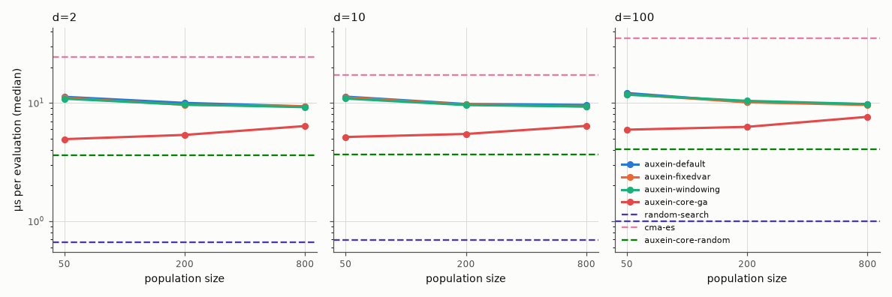
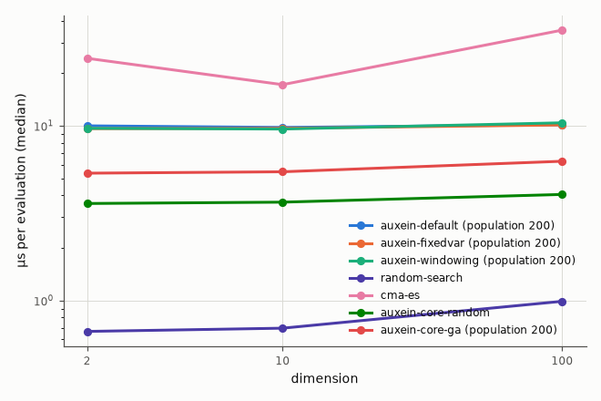

Fitness evaluations per generation, and generations completed within the overhead budget (median over dimensions).

| Algorithm | Population | Evaluations per generation | Generations |
|---|---|---|---|
| auxein-default | 50 | 54 | 369 |
| auxein-default | 200 | 204 | 97 |
| auxein-default | 800 | 804 | 23 |
| auxein-fixedvar | 50 | 54 | 369 |
| auxein-fixedvar | 200 | 204 | 97 |
| auxein-fixedvar | 800 | 804 | 23 |
| auxein-windowing | 50 | 54 | 369 |
| auxein-windowing | 200 | 204 | 97 |
| auxein-windowing | 800 | 804 | 23 |
| auxein-core-ga | 50 | 50 | 399 |
| auxein-core-ga | 200 | 50 | 396 |
| auxein-core-ga | 800 | 50 | 384 |

## 5. Sanity checks

- PASS: CMA-ES reaches 1e-6 on 10-D sphere: 25/25 runs reached 1e-6 (need at least 90%)
- PASS: CMA-ES reaches 1e-6 on 10-D ellipsoid: 25/25 runs reached 1e-6 (need at least 90%)
- PASS: random search does not reach 1e-3 on 10-D sphere: 0/25 runs reached 1e-3 (need none)

## 6. Methodology

- **Config**: `full`, commit `c0c4756718`, run at 2026-10-07T21:55:30+00:00 on 11 worker processes.
- **Software**: Python 3.12.13, auxein 0.2.0, numpy 2.5.3, pycma 4.5.0, scipy 1.18.1.
- **Machine**: Apple M4 Pro (12 logical CPUs), macOS-15.6.1-arm64-arm-64bit.
- **Budget**: 2000 × d fitness evaluations for every algorithm, counted outside the algorithms by `CountingObjective`. The initial population counts, and a partial generation is fine. Progress is always against evaluations, never generations.
- **Domain and conventions**: search domain [-5, 5]^d for every problem, boundaries not enforced. Optimum value 0, results are errors f(x) − f*. Algorithms see the noisy value on the noisy problem, the trace records the noise-free error of the evaluated point.
- **Instances**: each instance has its own random shift x* ~ U[-4, 4]^d (and, for the ellipsoid, a uniform random rotation from a QR decomposition with sign correction), drawn from a generator keyed by the instance id and the dimension, separate from algorithm randomness. Run k of every algorithm uses instance 0 + k, so comparisons are paired. 25 runs per combination.
- **Seeds**: run k uses seed 0 + k. Auxein is seeded with `np.random.seed(seed)` (it uses global numpy randomness), random search with `np.random.default_rng(seed)`, CMA-ES with seed + 1.
- **Precision targets**: 0.1, 0.001, 1e-06.
- **Traces**: best-so-far error at about 20 log-spaced evaluation counts per decade, plus the first and last evaluation. Plots show the median and the interquartile band over runs at each checkpoint. Errors below 1e-10 are drawn at 1e-10; dotted lines mark the targets.
- **Statistics**: two-sided Mann-Whitney U test on the final error of the reference algorithm (`auxein-default`, `auxein-core-ga`) against every other algorithm (scipy), with Holm correction over the comparisons of each problem × dimension table. A12 is the probability that a run of the reference ends with a lower error than a run of the other algorithm (ties count half); 0.5 is no difference. Effect size labels follow Vargha and Delaney: negligible below |A12 − 0.5| = 0.06, small below 0.14, medium below 0.21, large above. Significance level 0.05.
- **ERT (expected running time)**: total evaluations spent over all runs, divided by the number of successful runs, infinity if there is none. A successful run spends the evaluations it needed to first reach the target, an unsuccessful run spends everything it evaluated. It estimates the evaluations needed to reach the target if failed runs were restarted from scratch.
- **Algorithms**:
  - `auxein-default` (adapter `auxein_static`): `{"population_size": 100, "mutation": {"type": "self_adaptive", "tau": 0.1}, "distribution": "sigma_scaling", "offspring_size": 4, "alpha": 0.5}`
  - `auxein-fixedvar` (adapter `auxein_static`): `{"population_size": 100, "mutation": {"type": "fixed_variance", "sigma": 0.1}, "distribution": "sigma_scaling", "offspring_size": 4, "alpha": 0.5}`
  - `auxein-windowing` (adapter `auxein_static`): `{"population_size": 100, "mutation": {"type": "self_adaptive", "tau": 0.1}, "distribution": "fps_windowing", "offspring_size": 4, "alpha": 0.5}`
  - `random-search` (adapter `random_search`): `{}`
  - `cma-es` (adapter `cmaes`): `{"sigma0": 2.0, "x0_range": 4.0}`
  - `auxein-core-random` (adapter `auxein_core_random`): `{}`
  - `auxein-core-ga` (adapter `auxein_core_ga`): `{"population_size": 50, "offspring_size": 50, "selection": {"type": "tournament", "size": 2}, "recombination": {"type": "intermediate", "per_gene": false}, "mutation": {"type": "self_adaptive", "per_gene": false, "initial_step": 0.1, "min_step": 1e-12}, "repair": "clip"}`
- **Overhead benchmark**: Plain sphere, 20000 evaluations, 5 repeats (median reported), dimensions [2, 10, 100], population sizes [50, 200, 800] for the algorithms with a population. Run serially, after the quality runs, with one numpy thread per process. The time covers everything the algorithm does, including building the initial population and the budget-counting wrapper (identical for every algorithm).

### Algorithms and problems

| Problem | Definition (z = transformed x) | Tests |
|---|---|---|
| sphere | `Σ z_i²`, z = x − x* | sanity: everything should solve it |
| ellipsoid | `Σ 10^(6(i−1)/(d−1)) z_i²` (condition number 10⁶), z = R(x − x*) with a random rotation R | step-size adaptation across very different scales; rotation defeats per-axis tricks |
| rosenbrock | `Σ_{i<d} 100(z_{i+1} − z_i²)² + (1 − z_i)²`, z = x − x* + 1 | following a narrow curved valley |
| rastrigin | `10d + Σ (z_i² − 10 cos(2π z_i))`, z = x − x* | many regularly spaced local optima |
| noisy_sphere | sphere × `(1 + 0.1·ε)`, ε ~ N(0, 1) per call | robustness to noisy fitness (the trace records the noise-free error) |

### Reproducing

```
uv run --group bench python -m benchmarks run --config benchmarks/configs/full.toml
uv run --group bench python -m benchmarks report <results-dir>
```

The same config, commit and seeds give identical `runs.jsonl` contents, except for the `wall_time` fields.
