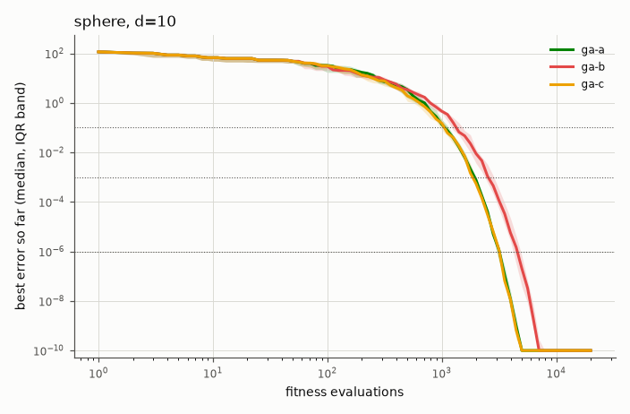
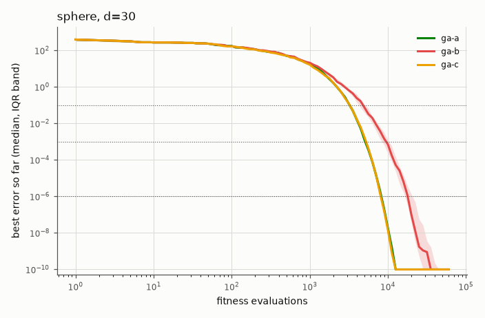
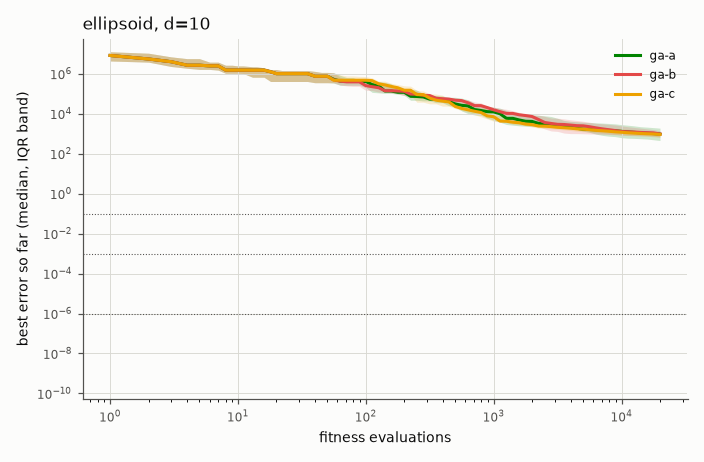
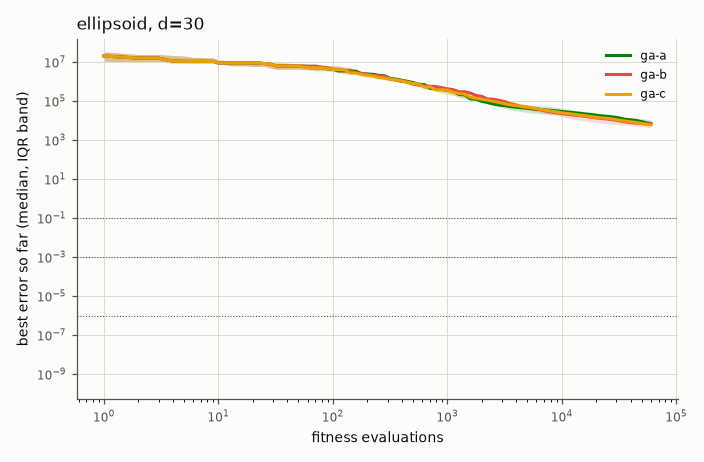
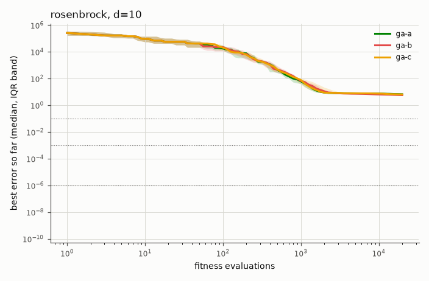
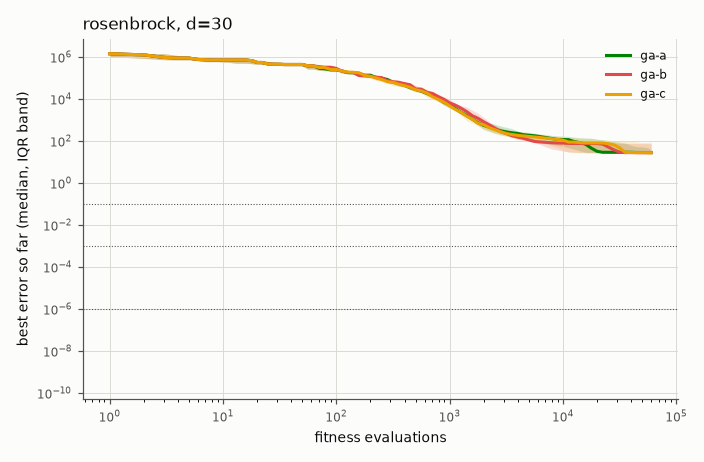
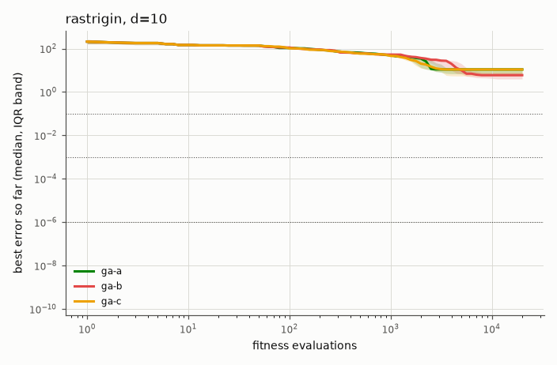
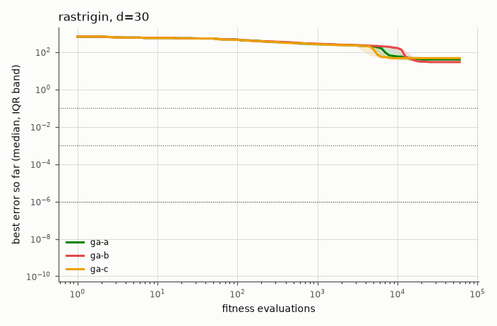
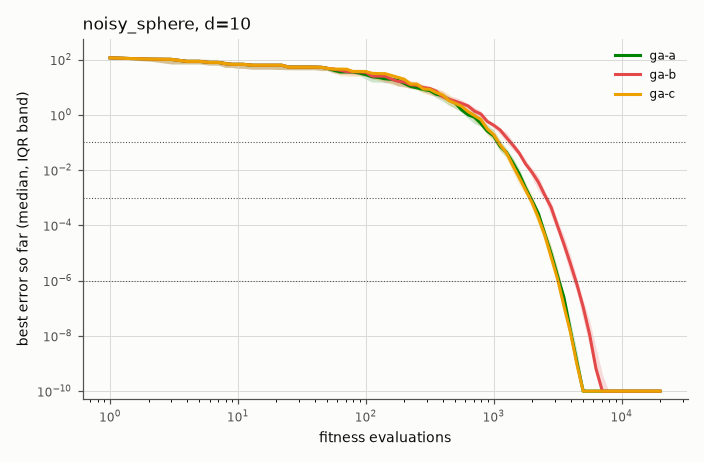
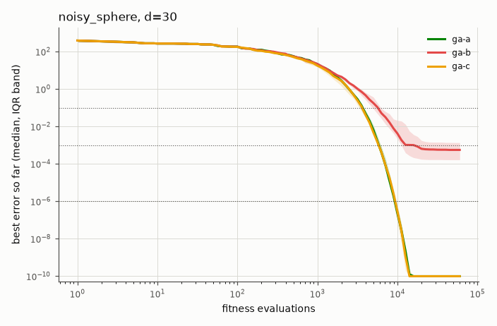

# Auxein benchmark report: ga-default-selection

## Findings

Choosing the default configuration of `GeneticAlgorithm`: three candidates, 15 runs each, on all five problems at d = 10 and 30, with the full budget (2000 × d evaluations). The instances (1000 to 1014) and seeds are not those of `full.toml` (instances 0 to 24), so the default is judged on other instances than it was chosen on.

- **A**: tournament selection (size 2), intermediate recombination, self-adaptive mutation with one step size per individual, clipping. μ = λ = 50.
- **B**: as A, with one self-adaptive step size per gene.
- **C**: as A, with stochastic universal sampling with sigma scaling instead of the tournament.

**Mean rank of the median final error** (the table under "Mean rank"): C 1.70, A 2.10, B 2.20. All three are within 0.5 of the best, a near tie, so the simplest configuration is chosen: **A is the default** (a tournament needs no weights, and one step size per individual is the simpler self-adaptation).

How far to trust the order: the same selection run before an internal optimisation of the strategy (which changes the order in which the population is stored, and with it the random draws, not the algorithm) gave A 1.80, B 2.10, C 2.10, a different order and the same near tie. With 15 runs per cell the three configurations cannot be told apart by their ranks; what the data do show is below.

- On the sphere and the noisy sphere all three reach errors around 10⁻²² at d = 10 and 30, except B, which is slower at d = 30 (2 × 10⁻¹⁵ on the sphere, 6 × 10⁻⁴ on the noisy sphere).
- B (per-gene step sizes) is the best on Rastrigin at both dimensions (d = 30: 28.9 against 39.8 for A and 46.8 for C), and by a small margin on Rosenbrock at d = 10.
- C is the best on the ellipsoid at both dimensions (d = 30: 6.1 × 10³ against 6.9 × 10³ for A), by a small margin.
- All three are far from solving the ellipsoid (errors of 10³ to 10⁴ for a condition number of 10⁶): isotropic step sizes cannot adapt to a rotated, ill-conditioned landscape.

## 1. Convergence

Median best-so-far error against fitness evaluations, with the interquartile band over runs.





















## 2. Summary

Final error, success rate per precision target (runs that reached it) and expected running time (ERT, in evaluations).

### sphere, d=10

| Algorithm | Final error, median [IQR] | Success 0.1 | Success 0.001 | Success 1e-06 | ERT 0.1 | ERT 0.001 | ERT 1e-06 |
|---|---|---|---|---|---|---|---|
| ga-a | 1.19e-22 [1.04e-22, 1.25e-22] | 15/15 | 15/15 | 15/15 | 1,117 | 1,922 | 3,186 |
| ga-b | 1.53e-22 [1.34e-22, 1.83e-22] | 15/15 | 15/15 | 15/15 | 1,382 | 2,623 | 4,513 |
| ga-c | 1.02e-22 [9.49e-23, 1.32e-22] | 15/15 | 15/15 | 15/15 | 1,052 | 1,910 | 3,145 |

### sphere, d=30

| Algorithm | Final error, median [IQR] | Success 0.1 | Success 0.001 | Success 1e-06 | ERT 0.1 | ERT 0.001 | ERT 1e-06 |
|---|---|---|---|---|---|---|---|
| ga-a | 1.19e-21 [1.12e-21, 1.28e-21] | 15/15 | 15/15 | 15/15 | 3,232 | 5,204 | 8,298 |
| ga-b | 1.98e-15 [3.83e-21, 8.45e-14] | 15/15 | 15/15 | 15/15 | 4,971 | 9,348 | 19,786 |
| ga-c | 1.21e-21 [1.14e-21, 1.28e-21] | 15/15 | 15/15 | 15/15 | 3,207 | 5,269 | 8,164 |

### ellipsoid, d=10

| Algorithm | Final error, median [IQR] | Success 0.1 | Success 0.001 | Success 1e-06 | ERT 0.1 | ERT 0.001 | ERT 1e-06 |
|---|---|---|---|---|---|---|---|
| ga-a | 957 [453, 1.9e+03] | 0/15 | 0/15 | 0/15 | ∞ | ∞ | ∞ |
| ga-b | 966 [701, 1.4e+03] | 0/15 | 0/15 | 0/15 | ∞ | ∞ | ∞ |
| ga-c | 914 [648, 1.17e+03] | 0/15 | 0/15 | 0/15 | ∞ | ∞ | ∞ |

### ellipsoid, d=30

| Algorithm | Final error, median [IQR] | Success 0.1 | Success 0.001 | Success 1e-06 | ERT 0.1 | ERT 0.001 | ERT 1e-06 |
|---|---|---|---|---|---|---|---|
| ga-a | 6.94e+03 [5.89e+03, 9.25e+03] | 0/15 | 0/15 | 0/15 | ∞ | ∞ | ∞ |
| ga-b | 6.69e+03 [4.37e+03, 1.13e+04] | 0/15 | 0/15 | 0/15 | ∞ | ∞ | ∞ |
| ga-c | 6.11e+03 [5.58e+03, 8.87e+03] | 0/15 | 0/15 | 0/15 | ∞ | ∞ | ∞ |

### rosenbrock, d=10

| Algorithm | Final error, median [IQR] | Success 0.1 | Success 0.001 | Success 1e-06 | ERT 0.1 | ERT 0.001 | ERT 1e-06 |
|---|---|---|---|---|---|---|---|
| ga-a | 6.81 [6.26, 7.15] | 0/15 | 0/15 | 0/15 | ∞ | ∞ | ∞ |
| ga-b | 5.8 [5.59, 6.02] | 0/15 | 0/15 | 0/15 | ∞ | ∞ | ∞ |
| ga-c | 6.58 [5.35, 7.31] | 0/15 | 0/15 | 0/15 | ∞ | ∞ | ∞ |

### rosenbrock, d=30

| Algorithm | Final error, median [IQR] | Success 0.1 | Success 0.001 | Success 1e-06 | ERT 0.1 | ERT 0.001 | ERT 1e-06 |
|---|---|---|---|---|---|---|---|
| ga-a | 28.5 [25.9, 38.6] | 0/15 | 0/15 | 0/15 | ∞ | ∞ | ∞ |
| ga-b | 28.2 [24.3, 75.5] | 0/15 | 0/15 | 0/15 | ∞ | ∞ | ∞ |
| ga-c | 28 [25.7, 86.4] | 0/15 | 0/15 | 0/15 | ∞ | ∞ | ∞ |

### rastrigin, d=10

| Algorithm | Final error, median [IQR] | Success 0.1 | Success 0.001 | Success 1e-06 | ERT 0.1 | ERT 0.001 | ERT 1e-06 |
|---|---|---|---|---|---|---|---|
| ga-a | 10.9 [6.96, 10.9] | 0/15 | 0/15 | 0/15 | ∞ | ∞ | ∞ |
| ga-b | 5.97 [3.98, 7.96] | 0/15 | 0/15 | 0/15 | ∞ | ∞ | ∞ |
| ga-c | 10.9 [5.47, 12.4] | 0/15 | 0/15 | 0/15 | ∞ | ∞ | ∞ |

### rastrigin, d=30

| Algorithm | Final error, median [IQR] | Success 0.1 | Success 0.001 | Success 1e-06 | ERT 0.1 | ERT 0.001 | ERT 1e-06 |
|---|---|---|---|---|---|---|---|
| ga-a | 39.8 [36.8, 52.7] | 0/15 | 0/15 | 0/15 | ∞ | ∞ | ∞ |
| ga-b | 28.9 [25.9, 31.8] | 0/15 | 0/15 | 0/15 | ∞ | ∞ | ∞ |
| ga-c | 46.8 [36.3, 53.2] | 0/15 | 0/15 | 0/15 | ∞ | ∞ | ∞ |

### noisy_sphere, d=10

| Algorithm | Final error, median [IQR] | Success 0.1 | Success 0.001 | Success 1e-06 | ERT 0.1 | ERT 0.001 | ERT 1e-06 |
|---|---|---|---|---|---|---|---|
| ga-a | 1.05e-22 [9.08e-23, 1.23e-22] | 15/15 | 15/15 | 15/15 | 1,102 | 1,967 | 3,297 |
| ga-b | 1.82e-22 [1.66e-22, 2.21e-22] | 15/15 | 15/15 | 15/15 | 1,363 | 2,575 | 4,330 |
| ga-c | 1.09e-22 [1.01e-22, 1.39e-22] | 15/15 | 15/15 | 15/15 | 1,090 | 1,932 | 3,201 |

### noisy_sphere, d=30

| Algorithm | Final error, median [IQR] | Success 0.1 | Success 0.001 | Success 1e-06 | ERT 0.1 | ERT 0.001 | ERT 1e-06 |
|---|---|---|---|---|---|---|---|
| ga-a | 1.18e-21 [1.13e-21, 1.28e-21] | 15/15 | 15/15 | 15/15 | 3,652 | 5,983 | 9,368 |
| ga-b | 5.62e-04 [1.66e-04, 1.37e-03] | 14/15 | 10/15 | 3/15 | 10,280 | 43,363 | 283,098 |
| ga-c | 1.27e-21 [1.20e-21, 1.34e-21] | 15/15 | 15/15 | 15/15 | 3,606 | 5,882 | 9,287 |

### Mean rank

Rank of each algorithm by the median final error in each problem × dimension (1 = best), and the mean rank.

| Algorithm | sphere d=10 | sphere d=30 | ellipsoid d=10 | ellipsoid d=30 | rosenbrock d=10 | rosenbrock d=30 | rastrigin d=10 | rastrigin d=30 | noisy_sphere d=10 | noisy_sphere d=30 | Mean rank |
|---|---|---|---|---|---|---|---|---|---|---|---|
| ga-c | 1 | 2 | 1 | 1 | 2 | 1 | 2 | 3 | 2 | 2 | 1.70 |
| ga-a | 2 | 1 | 2 | 3 | 3 | 3 | 3 | 2 | 1 | 1 | 2.10 |
| ga-b | 3 | 3 | 3 | 2 | 1 | 2 | 1 | 1 | 3 | 3 | 2.20 |

## 3. Statistical comparison

Final error of `auxein-default` against every other algorithm: two-sided Mann-Whitney U with Holm correction within each table, and the Vargha-Delaney A12 effect size (the probability that `auxein-default` wins).

No `auxein-default` runs in this benchmark.

## 4. Overhead

The overhead benchmark was not run.

## 5. Sanity checks

- CMA-ES reaches 1e-6 on 10-D sphere: not run in this benchmark
- CMA-ES reaches 1e-6 on 10-D ellipsoid: not run in this benchmark
- random search does not reach 1e-3 on 10-D sphere: not run in this benchmark

## 6. Methodology

- **Config**: `ga-default-selection`, commit `c4ad5374b2`, run at 2026-10-07T21:51:11+00:00 on 11 worker processes.
- **Software**: Python 3.12.13, auxein 0.2.0, numpy 2.5.3, pycma 4.5.0, scipy 1.18.1.
- **Machine**: Apple M4 Pro (12 logical CPUs), macOS-15.6.1-arm64-arm-64bit.
- **Budget**: 2000 × d fitness evaluations for every algorithm, counted outside the algorithms by `CountingObjective`. The initial population counts, and a partial generation is fine. Progress is always against evaluations, never generations.
- **Domain and conventions**: search domain [-5, 5]^d for every problem, boundaries not enforced. Optimum value 0, results are errors f(x) − f*. Algorithms see the noisy value on the noisy problem, the trace records the noise-free error of the evaluated point.
- **Instances**: each instance has its own random shift x* ~ U[-4, 4]^d (and, for the ellipsoid, a uniform random rotation from a QR decomposition with sign correction), drawn from a generator keyed by the instance id and the dimension, separate from algorithm randomness. Run k of every algorithm uses instance 1000 + k, so comparisons are paired. 15 runs per combination.
- **Seeds**: run k uses seed 1000 + k. Auxein is seeded with `np.random.seed(seed)` (it uses global numpy randomness), random search with `np.random.default_rng(seed)`, CMA-ES with seed + 1.
- **Precision targets**: 0.1, 0.001, 1e-06.
- **Traces**: best-so-far error at about 20 log-spaced evaluation counts per decade, plus the first and last evaluation. Plots show the median and the interquartile band over runs at each checkpoint. Errors below 1e-10 are drawn at 1e-10; dotted lines mark the targets.
- **Statistics**: two-sided Mann-Whitney U test on the final error of `auxein-default` against every other algorithm (scipy), with Holm correction over the comparisons of each problem × dimension table. A12 is the probability that a `auxein-default` run ends with a lower error than a run of the other algorithm (ties count half); 0.5 is no difference. Effect size labels follow Vargha and Delaney: negligible below |A12 − 0.5| = 0.06, small below 0.14, medium below 0.21, large above. Significance level 0.05.
- **ERT (expected running time)**: total evaluations spent over all runs, divided by the number of successful runs, infinity if there is none. A successful run spends the evaluations it needed to first reach the target, an unsuccessful run spends everything it evaluated. It estimates the evaluations needed to reach the target if failed runs were restarted from scratch.
- **Algorithms**:
  - `ga-a` (adapter `auxein_core_ga`): `{"population_size": 50, "offspring_size": 50, "selection": {"type": "tournament", "size": 2}, "recombination": {"type": "intermediate"}, "mutation": {"type": "self_adaptive", "per_gene": false}, "repair": "clip"}`
  - `ga-b` (adapter `auxein_core_ga`): `{"population_size": 50, "offspring_size": 50, "selection": {"type": "tournament", "size": 2}, "recombination": {"type": "intermediate"}, "mutation": {"type": "self_adaptive", "per_gene": true}, "repair": "clip"}`
  - `ga-c` (adapter `auxein_core_ga`): `{"population_size": 50, "offspring_size": 50, "selection": {"type": "sus", "scaling": 2.0}, "recombination": {"type": "intermediate"}, "mutation": {"type": "self_adaptive", "per_gene": false}, "repair": "clip"}`
- **Overhead benchmark**: not run

### Algorithms and problems

| Problem | Definition (z = transformed x) | Tests |
|---|---|---|
| sphere | `Σ z_i²`, z = x − x* | sanity: everything should solve it |
| ellipsoid | `Σ 10^(6(i−1)/(d−1)) z_i²` (condition number 10⁶), z = R(x − x*) with a random rotation R | step-size adaptation across very different scales; rotation defeats per-axis tricks |
| rosenbrock | `Σ_{i<d} 100(z_{i+1} − z_i²)² + (1 − z_i)²`, z = x − x* + 1 | following a narrow curved valley |
| rastrigin | `10d + Σ (z_i² − 10 cos(2π z_i))`, z = x − x* | many regularly spaced local optima |
| noisy_sphere | sphere × `(1 + 0.1·ε)`, ε ~ N(0, 1) per call | robustness to noisy fitness (the trace records the noise-free error) |

### Reproducing

```
uv run --group bench python -m benchmarks run --config benchmarks/configs/ga-default-selection.toml
uv run --group bench python -m benchmarks report <results-dir>
```

The same config, commit and seeds give identical `runs.jsonl` contents, except for the `wall_time` fields.
