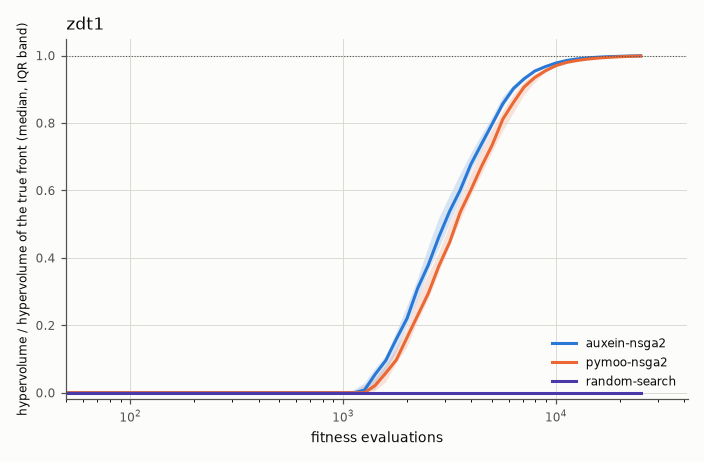
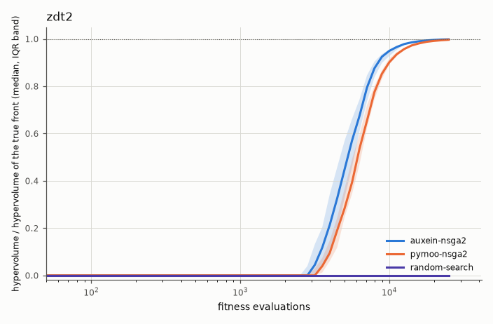
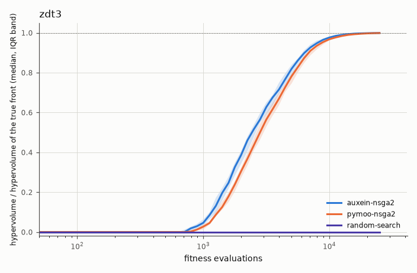
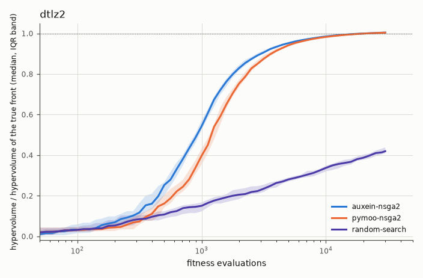
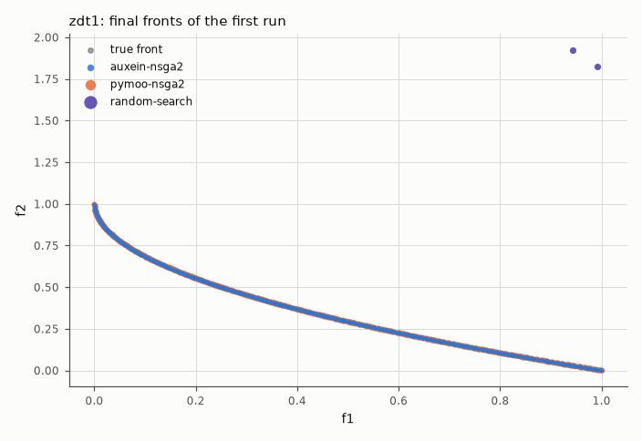
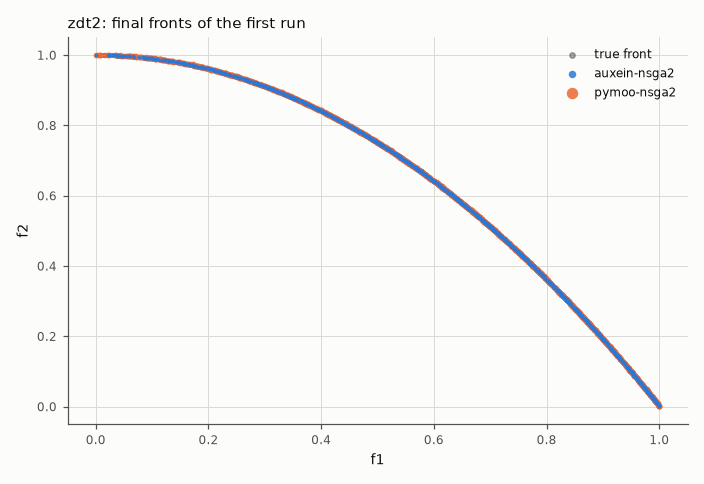
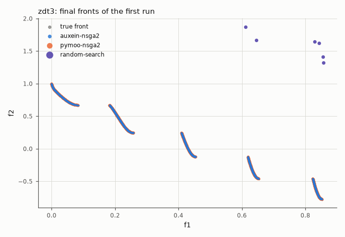
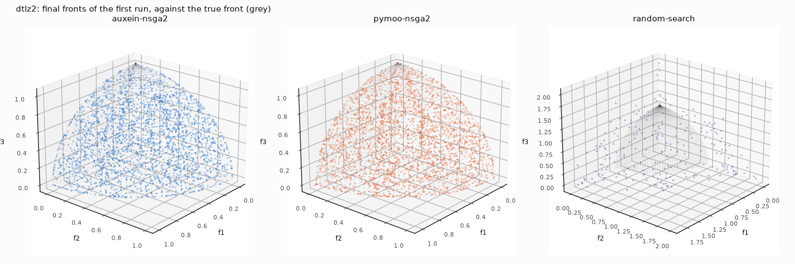

# Auxein multi-objective benchmark report: mo-full

## Findings

`NSGA2` (`auxein-nsga2`, its defaults: population 100, offspring 100, binary crowded tournament, simulated binary crossover with η = 15 and probability 0.9, polynomial mutation with η = 20) against pymoo's NSGA-II with the same population, operators and parameters, and against uniform random search. Four problems with known fronts: ZDT1, ZDT2 and ZDT3 (25,000 evaluations), DTLZ2 (30,000), 25 runs each with fixed seeds. The quality of a run is the **hypervolume** (against 1.1 × the nadir of the true front) and the **IGD+** of the non-dominated set of everything it evaluated; the statistics are Mann–Whitney with Holm correction and the Vargha–Delaney A₁₂. The acceptance criteria are those of design doc §11.4, criterion 7.

**Criterion 1: `auxein-nsga2` is not statistically worse than pymoo's NSGA-II on final hypervolume, on any problem: met.** It is **significantly better on all four**, by small margins:

| Problem | Final hypervolume, `auxein-nsga2` | pymoo | A₁₂ | Holm p | IGD+ (Auxein, pymoo) |
|---|---|---|---|---|---|
| ZDT1 | 0.8754 | 0.8748 | 1.00 | 2 × 10⁻⁹ | 6.9 × 10⁻⁴, 1.0 × 10⁻³ |
| ZDT2 | 0.5420 | 0.5410 | 1.00 | 1.4 × 10⁻⁹ | 6.7 × 10⁻⁴, 1.2 × 10⁻³ |
| ZDT3 | 1.0256 | 1.0249 | 0.95 | 5.5 × 10⁻⁸ | 3.5 × 10⁻⁴, 5.3 × 10⁻⁴ |
| DTLZ2 | 0.7941 | 0.7937 | 0.81 | 2 × 10⁻⁴ | 5.6 × 10⁻³, 5.8 × 10⁻³ |

- **Read the margins before the p-values.** Both implementations end at 99.7 to 99.9 % of the hypervolume of the true front on the ZDT problems; the gap is 0.05 to 0.2 % of it. It is consistent (a large effect in rank terms: Auxein wins nearly every pair of runs) and it is tiny. It reaches 95 % of the true front's hypervolume earlier as well (median 7,943 evaluations on ZDT1 against 8,913; 11,220 against 12,589 on ZDT2; 5,012 against 5,623 on DTLZ2; equal on ZDT3).
- **The cause was not isolated.** The two implementations are not identical, whatever the parameters say: Auxein's SBX is the *unbounded* form (children may leave the box and are clipped back, which is favourable on ZDT, where the optimum of 29 of the 30 variables lies on the bound 0), pymoo's is the *bounded* form of Deb's code; pymoo removes duplicate offspring and Auxein does not; Auxein makes one child per pair of parents and pymoo two. DTLZ2, whose optimum is in the interior, shows the smallest margin, which fits the first explanation but does not prove it. The comparison is exactly the one described: the same parameters on two implementations.
- **Nothing was tuned against these instances.** The defaults are the textbook ones from the design (§3.3), fixed before the benchmark existed; the config was run twice (once from a working tree with uncommitted changes to the report code, once on the clean commit recorded in `metadata.json`, which is the one committed here), and the 300 runs were identical (apart from wall time).

**Criterion 2: `auxein-nsga2` is significantly better than random search on every problem: met** (A₁₂ = 1.00, Holm p ≤ 3 × 10⁻⁹ everywhere). Random search never gets a point inside the reference box of a ZDT problem within the budget (its hypervolume is 0, so look at IGD+: 1.4 to 2.8 against 3.5 × 10⁻⁴ to 1.2 × 10⁻³), and reaches 42 % of the true front's hypervolume on DTLZ2 against 100 %.

**What the fronts look like.** On ZDT3 the final fronts of both algorithms cover the five disconnected pieces of the true front; on DTLZ2 the 7,000 or so non-dominated points of both cover the whole octant of the sphere (the plot shows 2,500 of them). The hypervolume of a front can exceed that of the sample of the true front by a hair (100.4 % on DTLZ2), because the sample is finite.

**Cost.** Median wall time of a run (it includes the harness's indicator computations, identical for both): `auxein-nsga2` 1.4 to 1.6 s on the ZDT problems and 7.9 s on DTLZ2, pymoo 1.0 to 1.1 s and 4.6 s, on 12 cores with one numpy thread per process. Auxein is 1.4 to 1.7 times slower here; the difference is the Python of the driver and of the strategy around each generation, not the sorting. The driver's Pareto archive, which grows to thousands of points on DTLZ2, was a Python loop per evaluation that took 53 s per DTLZ2 run before it was vectorised as part of this step (6 s after).

## 1. Hypervolume against evaluations

Median and interquartile band over runs, as a share of the hypervolume of the true front.









## 2. Final fronts

The non-dominated set of the first run of every algorithm, against the true front.









## 3. Summary

### zdt1

| Algorithm | Final hypervolume, median [IQR] | Share of the true front's hypervolume | IGD+, median [IQR] | Non-dominated points, median |
|---|---|---|---|---|
| auxein-nsga2 | 0.8754 [0.8753, 0.8756] | 99.9% | 6.91e-04 [5.89e-04, 7.69e-04] | 1334 |
| pymoo-nsga2 | 0.8748 [0.8747, 0.8749] | 99.8% | 1.01e-03 [9.69e-04, 1.11e-03] | 1210 |
| random-search | 0.0000 [0.0000, 0.0000] | 0.0% | 1.64 [1.58, 1.7] | 24 |

### zdt2

| Algorithm | Final hypervolume, median [IQR] | Share of the true front's hypervolume | IGD+, median [IQR] | Non-dominated points, median |
|---|---|---|---|---|
| auxein-nsga2 | 0.5420 [0.5419, 0.5421] | 99.9% | 6.67e-04 [6.10e-04, 7.24e-04] | 1285 |
| pymoo-nsga2 | 0.5410 [0.5408, 0.5412] | 99.7% | 1.19e-03 [1.11e-03, 1.29e-03] | 1052 |
| random-search | 0.0000 [0.0000, 0.0000] | 0.0% | 2.8 [2.73, 2.87] | 12 |

### zdt3

| Algorithm | Final hypervolume, median [IQR] | Share of the true front's hypervolume | IGD+, median [IQR] | Non-dominated points, median |
|---|---|---|---|---|
| auxein-nsga2 | 1.0256 [1.0255, 1.0257] | 99.9% | 3.48e-04 [3.15e-04, 3.84e-04] | 1195 |
| pymoo-nsga2 | 1.0249 [1.0248, 1.0252] | 99.9% | 5.26e-04 [4.70e-04, 5.58e-04] | 1104 |
| random-search | 0.0000 [0.0000, 0.0000] | 0.0% | 1.42 [1.32, 1.47] | 28 |

### dtlz2

| Algorithm | Final hypervolume, median [IQR] | Share of the true front's hypervolume | IGD+, median [IQR] | Non-dominated points, median |
|---|---|---|---|---|
| auxein-nsga2 | 0.7941 [0.7939, 0.7943] | 100.4% | 5.56e-03 [5.45e-03, 5.63e-03] | 7168 |
| pymoo-nsga2 | 0.7937 [0.7935, 0.7940] | 100.4% | 5.82e-03 [5.67e-03, 5.93e-03] | 7526 |
| random-search | 0.3317 [0.3243, 0.3464] | 41.9% | 0.198 [0.192, 0.205] | 238 |

## 4. Statistical comparison

### zdt1

| auxein-nsga2 vs | median hypervolume (auxein-nsga2) | median hypervolume (other) | A12 | p | p (Holm) | Reading |
|---|---|---|---|---|---|---|
| pymoo-nsga2 | 0.8754 | 0.8748 | 1.00 | 2e-09 | 2e-09 | auxein-nsga2 better, large effect |
| random-search | 0.8754 | 0.0000 | 1.00 | 9.7e-11 | 1.9e-10 | auxein-nsga2 better, large effect |

### zdt2

| auxein-nsga2 vs | median hypervolume (auxein-nsga2) | median hypervolume (other) | A12 | p | p (Holm) | Reading |
|---|---|---|---|---|---|---|
| pymoo-nsga2 | 0.5420 | 0.5410 | 1.00 | 1.4e-09 | 1.4e-09 | auxein-nsga2 better, large effect |
| random-search | 0.5420 | 0.0000 | 1.00 | 9.7e-11 | 1.9e-10 | auxein-nsga2 better, large effect |

### zdt3

| auxein-nsga2 vs | median hypervolume (auxein-nsga2) | median hypervolume (other) | A12 | p | p (Holm) | Reading |
|---|---|---|---|---|---|---|
| pymoo-nsga2 | 1.0256 | 1.0249 | 0.95 | 5.5e-08 | 5.5e-08 | auxein-nsga2 better, large effect |
| random-search | 1.0256 | 0.0000 | 1.00 | 1.4e-10 | 2.8e-10 | auxein-nsga2 better, large effect |

### dtlz2

| auxein-nsga2 vs | median hypervolume (auxein-nsga2) | median hypervolume (other) | A12 | p | p (Holm) | Reading |
|---|---|---|---|---|---|---|
| pymoo-nsga2 | 0.7941 | 0.7937 | 0.81 | 0.0002 | 0.0002 | auxein-nsga2 better, large effect |
| random-search | 0.7941 | 0.3317 | 1.00 | 1.4e-09 | 2.8e-09 | auxein-nsga2 better, large effect |

## 5. Acceptance

- PASS: zdt1: `auxein-nsga2` is not significantly worse than pymoo's NSGA-II on final hypervolume (A12 = 1.00, Holm p = 2e-09)
- PASS: zdt1: `auxein-nsga2` is significantly better than random search on final hypervolume (A12 = 1.00, Holm p = 1.9e-10)
- PASS: zdt2: `auxein-nsga2` is not significantly worse than pymoo's NSGA-II on final hypervolume (A12 = 1.00, Holm p = 1.4e-09)
- PASS: zdt2: `auxein-nsga2` is significantly better than random search on final hypervolume (A12 = 1.00, Holm p = 1.9e-10)
- PASS: zdt3: `auxein-nsga2` is not significantly worse than pymoo's NSGA-II on final hypervolume (A12 = 0.95, Holm p = 5.5e-08)
- PASS: zdt3: `auxein-nsga2` is significantly better than random search on final hypervolume (A12 = 1.00, Holm p = 2.8e-10)
- PASS: dtlz2: `auxein-nsga2` is not significantly worse than pymoo's NSGA-II on final hypervolume (A12 = 0.81, Holm p = 0.0002)
- PASS: dtlz2: `auxein-nsga2` is significantly better than random search on final hypervolume (A12 = 1.00, Holm p = 2.8e-09)

## 6. Methodology

- **Config**: `mo-full`, commit `b599d73371`, run at 2026-10-10T18:42:38+00:00 on 12 worker processes.
- **Software**: Python 3.12.13, auxein 0.3.0.dev0, numpy 2.5.3, pymoo 0.6.2, scipy 1.18.1.
- **Machine**: Apple M4 Pro (12 logical CPUs), macOS-15.6.1-arm64-arm-64bit.
- **Budget** (fitness evaluations per run, counted outside the algorithms by `MOCountingObjective`): zdt1: 25,000, zdt2: 25,000, zdt3: 25,000, dtlz2: 30,000. The initial population counts and a partial generation is fine. Progress is always against evaluations.
- **Runs and seeds**: 25 runs per problem and algorithm; run k uses seed 0 + k. The problems have no instances: runs differ by the seed of the algorithm alone.
- **What is measured**: the **non-dominated set of everything a run has evaluated so far** (an archive kept by the harness, not the algorithm's population). The **hypervolume** of that set against a fixed reference point (1.1 times the nadir point of the true front, componentwise) is the main indicator (higher is better), and **IGD+** to a dense sample of the true front the secondary one (lower is better). Both are computed with pymoo's `HV` and `IGDPlus`. Hypervolume is also shown as a share of the hypervolume of the true front itself (the same dense sample), so that 100% is a perfect front (it can exceed it by a hair: the sample of the true front is finite, and a front of thousands of points covers slightly more). Traces are recorded at about 20 log-spaced evaluation counts per decade.
- **Statistics**: two-sided Mann-Whitney U on the final hypervolume of the reference (`auxein-nsga2`) against every other algorithm, with Holm correction over the comparisons of each problem. A12 is the probability that a run of the reference ends with a *higher* hypervolume than a run of the other algorithm (ties count half). Effect size labels follow Vargha and Delaney (negligible below |A12 − 0.5| = 0.06, small below 0.14, medium below 0.21, large above). Significance level 0.05.
- **Algorithms**:
  - `auxein-nsga2` (adapter `auxein_nsga2`): `{"population_size": 100, "offspring_size": 100, "crossover_probability": 0.9, "sbx_eta": 15, "mutation_eta": 20}`
  - `pymoo-nsga2` (adapter `pymoo_nsga2`): `{"population_size": 100, "offspring_size": 100, "crossover_probability": 0.9, "sbx_eta": 15, "mutation_eta": 20}`
  - `random-search` (adapter `mo_random_search`): `{}`
- **Differences from pymoo's NSGA-II that the parameters do not remove**: Auxein's simulated binary crossover is the *unbounded* form (children may leave the box and are clipped back by the bounds repair), pymoo's is the *bounded* form of Deb's code; pymoo eliminates duplicate offspring and Auxein does not; Auxein makes one child per pair of parents and pymoo two.

### Problems

| Problem | Objectives, variables | Front | Reference point for hypervolume |
|---|---|---|---|
| zdt1 | 2, 30 in [0, 1] | convex, `f2 = 1 − √f1` | (1.1, 1.1) |
| zdt2 | 2, 30 in [0, 1] | concave, `f2 = 1 − f1²` | (1.1, 1.1) |
| zdt3 | 2, 30 in [0, 1] | five disconnected pieces of `f2 = 1 − √f1 − f1 sin(10π f1)` | (1.1 × 0.8518, 1.1 × 1) |
| dtlz2 | 3, 12 in [0, 1] | the positive octant of the unit sphere | (1.1, 1.1, 1.1) |

### Reproducing

```
uv run --group bench python -m benchmarks run --config benchmarks/configs/mo-full.toml
uv run --group bench python -m benchmarks report <results-dir>
```

The same config, commit and seeds give identical `runs.jsonl` contents, except for the `wall_time` fields.
